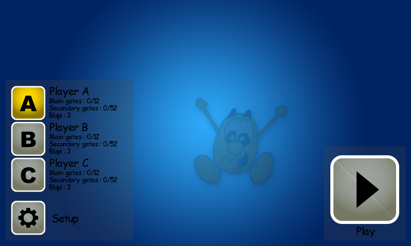
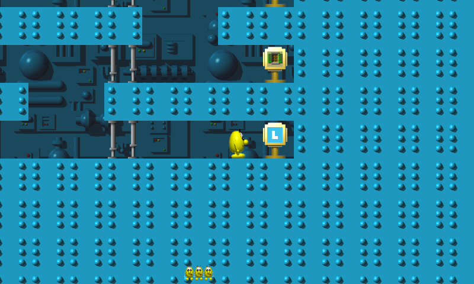

# Appendix G: Screenshot and Visual Asset Gallery

This appendix is the index and provenance record for every real image used across this book. It
does not repeat the narrative catalogs in [Part V](../part05-sprites-rendering-animation/ch28-pixmap-ipixmap.md)
(chapters 28–37 already embed and discuss all 84 Blupi animation sheets, 58 object/creature sheets,
8 explosion sheets, 8 atlas overviews, and the background/text/gauge assets in full) — instead it
answers three questions in one place: *what real screenshots exist*, *how they were captured*, and
*where the complete machine-readable index of every other image lives*.

Per this book's own methodology (`CLAUDE.md`, "Images and screenshots"), every image anywhere in
this book falls into exactly one of three categories, and every single one of the 167 files in
`book/images/` is labeled with its category in `book/images/MANIFEST.md`:

1. A pixel-accurate crop of a real sprite atlas shipped in `mobile-eggbert`.
2. A real screenshot captured from an actually-built, actually-running copy of the game.
3. A data-driven diagram reconstructed from real level files or table data, clearly labeled as a
   reconstruction, not a screenshot.

No image in this book was mocked up, AI-generated, or fabricated. This appendix covers category 2
in depth (there are only two such images, and how they were obtained is worth recording precisely)
and points to `MANIFEST.md` for the complete, current index of categories 1 and 3.

## Real screenshots (category 2)

Two real screenshots exist, both captured in this project's own working session by building the
actual `WindowsPhoneSpeedyBlupi` CMake target headlessly and running it to completion. The full,
reproducible account — exact commands, exact errors hit and how they were resolved, environment
notes — is preserved at `tools/SCREENSHOT_ATTEMPT.md`; this section summarizes it.

### `screenshot-title-menu.png`

*A genuine `Texture2D::SaveAsPng` dump of the game's own back buffer, captured mid-run from an
actually-built, actually-running binary — not a mockup.*

### `screenshot-gameplay-level1.png`

*Also a genuine back-buffer dump, captured a fixed number of frames after the game's own `Play`
button handler (`Def::ButtonGlyph::InitPlay` → `SetPhase(Def::Phase::Play, 1)`, the same call a
real button press makes) was invoked programmatically — not a shortcut around the game's own logic,
just an automated press of the same button a player would press.*

### How both were obtained

Both dumps came from a single headless run of the game built with **CNA's `SOFTWARE` graphics
backend** — a pure CPU rasterizer that needs no `DISPLAY`, no `Xvfb`, and no GPU of any kind. This
was the harder of the two paths this book's own methodology anticipated (the easier fallback,
`SDL_RENDERER`/`EASYGL` under `Xvfb` + Mesa `llvmpipe`, was never even needed) and it resolved an
open question going in: whether `SOFTWARE`'s rasterizer, previously only verified against a small
demo's raw 3D `VertexBuffer` draws, would also handle the real game's actual `SpriteBatch`-based 2D
rendering path (`Pixmap`, see [Chapter 28](../part05-sprites-rendering-animation/ch28-pixmap-ipixmap.md)).
It does, for this game's usage pattern.

Concretely, in order:

1. Cloned `cna` (the graphics framework) and, once CMake's own error message revealed it as an
   undocumented requirement, `sharp-runtime` — both as siblings of the `mobile-eggbert` checkout.
2. Installed the same apt packages `cna-bible`'s own screenshot-infrastructure notes list.
3. Configured and built the real `WindowsPhoneSpeedyBlupi` target with
   `-DCNA_GRAPHICS_BACKEND=SOFTWARE` — it compiled cleanly on the first try, no source changes
   needed anywhere in `mobile-eggbert`'s own code.
4. Added one small, isolated, environment-variable-gated patch to the end of `Game1::Draw()` (dead
   code unless `MEB_SCREENSHOT_DIR` is set) that waits for the real menu phase, dumps a PNG, issues
   the same `SetPhase` call the Play button makes, waits for gameplay to genuinely start, dumps a
   second PNG, and exits. The full diff is preserved at `tools/screenshot-capture.patch`,
   reproducible against `mobile-eggbert` commit `07e0a67`.
5. Worked around one unrelated headless-container gap (`MIX_CreateMixerDevice failed: No available
   audio device`) with SDL's dummy audio driver (`SDL_AUDIODRIVER=dummy`) — nothing to do with
   graphics, and not a mobile-eggbert or CNA bug.

No gameplay code, rendering code, or CMake files were permanently modified — the one temporary
patch lives only as a `.patch` file in this book's own `tools/` directory, applied against a
disposable working copy of `mobile-eggbert` for the duration of the capture.

### Why there are only two

The task budget for this spike covered getting *a* real title screen and *a* real gameplay frame —
both succeeded on the first real attempt, which is itself a useful data point about the `SOFTWARE`
backend's real-world readiness (see [Chapter 7](../part02-building-and-running/ch07-direct3d-wine-proton.md)
and [Chapter 8](../part02-building-and-running/ch08-web-emscripten-build.md) for this book's other
backend-specific findings). Capturing further gameplay states (a later level, a death screen, a
win screen, the pause menu) is a natural extension of the same infrastructure — the patch already
in `tools/screenshot-capture.patch` generalizes directly to "wait for a different phase/mission
state, then dump" — but was out of scope for this pass.

## Sprite, animation, and diagram images (categories 1 and 3): see `MANIFEST.md`

The complete, current, machine-readable index of every remaining image — all 165 of them — lives at
`book/images/MANIFEST.md`, generated directly by `tools/extract_sprites.py` and
`tools/render_level_map.py` (plus a short hand-written addendum for a handful of unmodified real
asset copies added by [Chapter 34](../part05-sprites-rendering-animation/ch34-backgrounds-and-level-art.md)
and [Chapter 36](../part05-sprites-rendering-animation/ch36-jauge-hud-gauges.md)). For each image it
records the exact source table or algorithm it came from, so any claim about provenance in this
book can be checked against real, re-runnable code rather than taken on faith. In summary, it
covers:

| Category | Count | Chapters that present them |
|---|---|---|
| `blupi-action-*.png` — real `BlupiAction` animation sheets | 84 | [Chapter 18](../part04-decor-simulation/ch18-blupi-actions-and-animation.md), [Chapter 31](../part05-sprites-rendering-animation/ch31-blupi-animation-catalog.md) |
| `object-*.png` — real `ObjectType` creature/object animation sheets | 58 | [Chapter 32](../part05-sprites-rendering-animation/ch32-creature-and-object-animation-catalog.md) |
| `explosion-table_explo*.png` — real explosion/effect sheets | 8 | [Chapter 33](../part05-sprites-rendering-animation/ch33-explosions-and-effects.md) |
| `atlas-*-grid.png` — full real atlas files with grid overlays | 8 | [Chapter 29](../part05-sprites-rendering-animation/ch29-sprite-atlas-system.md) |
| `level-map-world*.png` — reconstructed collision/classification diagrams (**not** screenshots) | 3 | [Chapter 16](../part04-decor-simulation/ch16-tile-map.md), [Appendix C](appendix-c-level-file-format-spec.md) |
| `background-*.png`, `jauge-full.png` — unmodified real asset copies | 4 | [Chapter 34](../part05-sprites-rendering-animation/ch34-backgrounds-and-level-art.md), [Chapter 36](../part05-sprites-rendering-animation/ch36-jauge-hud-gauges.md) |
| `screenshot-*.png` — real captured screenshots (this appendix) | 2 | Chapter 28, this appendix |
| **Total** | **167** | |

`MANIFEST.md` also records this pipeline's own honesty notes worth restating here: a small number
of animation edge cases (15 degenerate `table_blupi` filler records, a genuine array-bounds
inconsistency in `table_tiplouf`, two object types whose sprite channel is a reasoned inference
rather than an explicitly located assignment) are flagged explicitly rather than silently smoothed
over — consistent with this whole book's rule that an honestly-reported gap beats a confidently
wrong guess every time.

## See also

- [Chapter 28: Pixmap/IPixmap](../part05-sprites-rendering-animation/ch28-pixmap-ipixmap.md)
- [Chapter 29: The Sprite Atlas System](../part05-sprites-rendering-animation/ch29-sprite-atlas-system.md)
- [Chapter 31: The Blupi Animation Catalog](../part05-sprites-rendering-animation/ch31-blupi-animation-catalog.md)
- [Appendix C: Level File Format Specification](appendix-c-level-file-format-spec.md)
- `tools/SCREENSHOT_ATTEMPT.md`, `tools/screenshot-capture.patch`, `book/images/MANIFEST.md`
