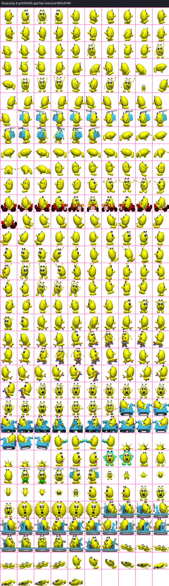
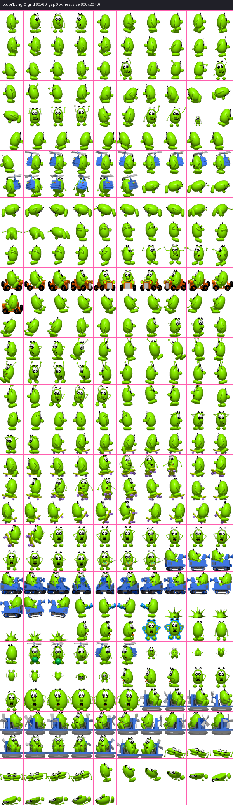
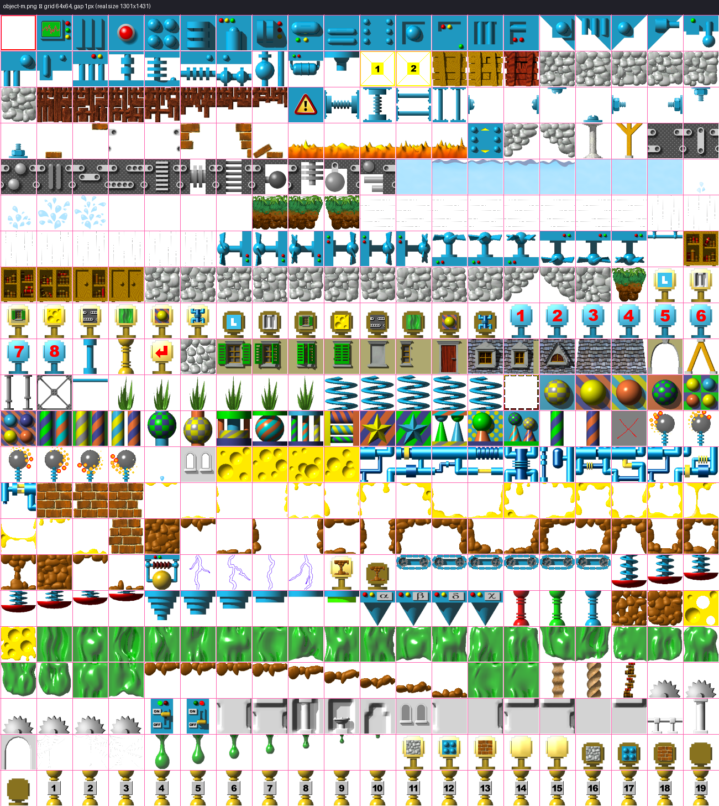
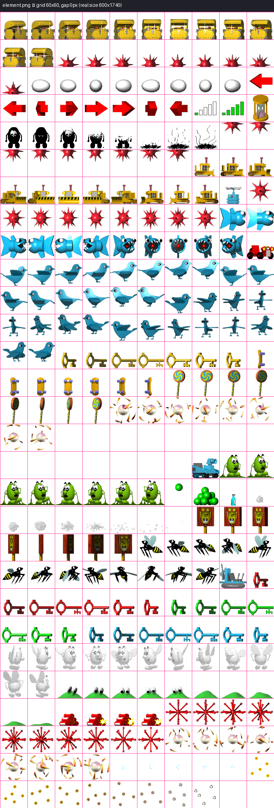
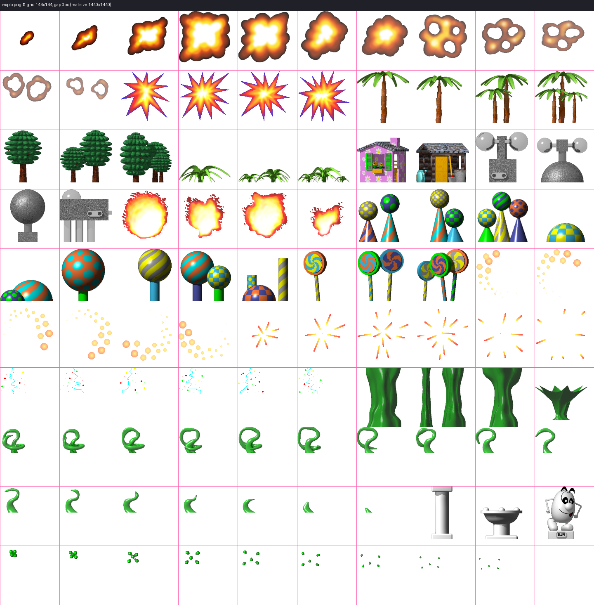
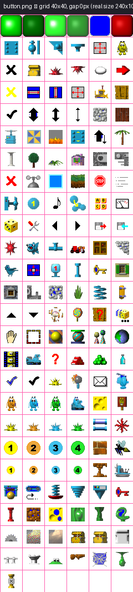
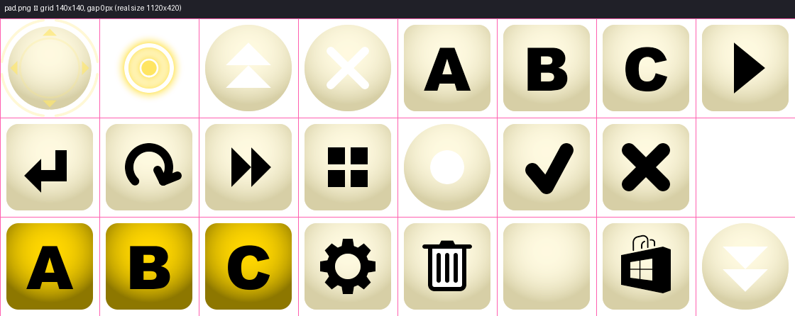

# Chapter 29: The Sprite Atlas System

## One algorithm, ten grids

Chapter 28 established that `Pixmap::DrawIcon()` turns an `(channel, icon)` pair into a rectangle
inside one of ten texture atlases. This chapter is about the mechanism that makes that possible:
`PixmapChannel`, the enum that names each atlas, and `Pixmap::GetSrcRectangle()`, the one function
that slices every one of them. There is exactly one slicing algorithm in the entire game — no
per-atlas special-casing at the pixel-math level — and this chapter reads it precisely, then shows,
image by image, exactly where it cuts.

## `PixmapChannel`: naming the atlases

*From `def/PixmapChannel.hpp:33-52`:*
```cpp
enum class PixmapChannel : PixmapChannelUnderlying
{
    PixmapChannel0          = 0,  ///< Reserved / unused channel 0.
    Object                  = 1,  ///< Moving objects sprite sheet (bitmapObject).
    Blupi                   = 2,  ///< Main Blupi character sprite sheet (bitmapBlupi).
    Background              = 3,  ///< World/decor background tiles (bitmapBackground via BackgroundCache).
    Button                  = 4,  ///< UI buttons sprite sheet (bitmapButton).
    Jauge                   = 5,  ///< HUD gauge/status bar sprite sheet (bitmapJauge).
    Text                    = 6,  ///< Font/text glyph sprite sheet (bitmapText).
    Explosion               = 9,  ///< Explosion particle sprite sheet (bitmapExplo).
    Element                 = 10, ///< Collectible elements sprite sheet (bitmapElement).
    Blupi1_11               = 11, ///< Alternate Blupi sprite sheet variant 1 (bitmapBlupi1).
    Blupi1_12               = 12, ///< Alternate Blupi sprite sheet variant 2 (bitmapBlupi1).
    Blupi1_13               = 13, ///< Alternate Blupi sprite sheet variant 3 (bitmapBlupi1).
    Pad                     = 14, ///< Touch-input pad overlay sprite sheet (bitmapPad).
    SpeedyBlupiBackground   = 15, ///< Speedy Blupi title/background (bitmapSpeedyBlupi).
    BlupiYoupieBackground   = 16, ///< Blupi Youpie background (bitmapBlupiYoupie).
    GearBackground          = 17  ///< Gear/settings background (bitmapGear).
};
```

Two structural details are worth flagging up front, both stated explicitly in the header's own
comments: values `7` and `8` are simply unused gaps (`PixmapChannel.hpp:6, 29`), and three distinct
enumerators — `Blupi1_11`, `Blupi1_12`, `Blupi1_13` — all resolve to the *same* underlying texture,
`bitmapBlupi1` (`Pixmap::GetBitmap()`, `Pixmap.cpp:751-754`). `blupi1.png` is loaded once but
addressed under three different channel identities; [Chapter 31](ch31-blupi-animation-catalog.md)'s
manifest notes explain the one confirmed real use of this texture (the electric-arc effect's first
30 frames, plus the `ObjectType201`/`202`/`203` avatar skin variants).

## `GetSrcRectangle`: the one true slicing algorithm

Every atlas in this game, without exception, is a uniform grid of equally-sized cells (with an
optional per-cell gap), addressed row-major by a flat integer `icon` index. `GetSrcRectangle()` is
the entire implementation of that idea:

*From `Pixmap.cpp:683-697`:*
```cpp
Microsoft::Xna::Framework::Rectangle Pixmap::GetSrcRectangle(const Texture2D& bitmap, intcs bitmapGridX,
                                                             intcs bitmapGridY,
                                                             intcs iconWidth, intcs iconHeight, intcs gap,
                                                             intcs icon)
{
    intcs width = bitmap.getBoundsProperty().Width;
    // warning: variable height is not used
    intcs height = bitmap.getBoundsProperty().Height;
    intcs column = icon % (width / bitmapGridX);
    intcs row = icon / (width / bitmapGridX);
    bitmapGridX += gap;
    bitmapGridY += gap;
    return Microsoft::Xna::Framework::Rectangle(gap + column * bitmapGridX, gap + row * bitmapGridY, iconWidth,
                                                iconHeight);
}
```

Reading this exactly (the compiler's own `height` unused-variable warning is preserved verbatim in
the source and is real, not a copy error introduced here): the number of columns is derived
entirely from the texture's *actual pixel width* divided by the cell width (`width / bitmapGridX`)
— never a hard-coded column count — so `column = icon % columnsPerRow` and `row = icon / columnsPerRow`
recover a 2D grid position from a flat index using ordinary row-major arithmetic. The `height`
parameter passed in is never consulted for that division; only `width` determines how many columns
the grid has, which is safe here because every atlas in this game is in fact wide enough to express
its whole icon range in a small number of tall columns rather than being row-constrained, but it is
worth stating precisely rather than assuming symmetric behavior on both axes.

The gap handling is a genuine, easily-missed subtlety: `gap` is added to the effective cell stride
(`bitmapGridX/Y += gap`) *before* it's multiplied by `column`/`row`, and the returned rectangle's
top-left corner is offset by one additional `gap` beyond that (the leading `gap +` term). This
means each cell is preceded by a `gap`-pixel margin, including the very first cell at row 0/column
0 — a border, not merely inter-cell spacing. `object-m.png` is the only atlas in the game with a
non-zero gap (`1` pixel — see the table below), and this formula is exactly why: a 1-pixel
transparent border on every side of every 64×64 cell prevents texture-filtering bleed between
adjacent object sprites when the game is scaled to non-integer zoom factors, at the cost of a
slightly larger backing PNG.

`iconWidth`/`iconHeight` — the size of the rectangle actually returned — are passed in *separately*
from `bitmapGridX`/`bitmapGridY` (the grid's *stride*). For every channel except `Explosion` these
two pairs are numerically identical (a 60×60 grid returns 60×60 rectangles, a 64×64 grid returns
64×64 rectangles, and so on), but the distinction matters precisely because `Explosion` is the one
channel where they diverge — its stride is a uniform 144×144, but the *returned* rectangle size
varies per icon, taken from `Tables::table_explo_size[icon]` rather than from the grid cell size
itself (see the table below, and [Chapter 33](ch33-explosions-and-effects.md) for how that plays
out across the eight explosion tables).

## The per-channel grid table, read directly from `DrawIcon`'s `switch`

`Pixmap::DrawIcon()`'s `switch (channel)` (`Pixmap.cpp:550-658`) is the single source of truth for
every atlas's grid geometry. Reading it channel by channel:

| Channel(s) | Backing file | Grid cell (src) | Gap | Dest size | Real atlas dimensions |
|---|---|---|---|---|---|
| `Blupi`, `Blupi1_11/12/13` | `blupi.png` / `blupi1.png` | 60×60 | 0 | 60×60 | 600×2040 (10 cols × 34 rows = 340 slots) |
| `Object` | `object-m.png` | 64×64 | 1 | 64×64 | 1301×1431 |
| `Element` | `element.png` | 60×60 | 0 | 60×60 | 600×1740 (10 cols × 29 rows = 290 slots) |
| `Explosion` | `explo.png` | 144×144 (stride) | 0 | per-icon, from `Tables::table_explo_size[icon]` (width = `max(height, 128)`) | 1440×1440 |
| `Text` | `text.png` | 32×32 | 0 | 32×32 | 512×256 |
| `Button` | `button.png` | 40×40 | 0 | 40×40 | 240×1040 |
| `Pad` | `pad.png` | 140×140 | 0 | 140×140 | 1120×420 |
| `SpeedyBlupiBackground` | `speedyblupi.png` | 640×160 | 0 | 640×160 | 640×160 (single cell) |
| `BlupiYoupieBackground` | `blupiyoupie.png` | 410×380 | 0 | 410×380 | 410×380 (single cell) |
| `GearBackground` | `gear.png` | 226×226 | 0 | 226×226 | 226×226 (single cell) |

*From `Pixmap.cpp:550-648` (the `Blupi`/`Object`/`Explosion` cases, verbatim):*
```cpp
case PixmapChannel::Blupi:
case PixmapChannel::Blupi1_11:
case PixmapChannel::Blupi1_12:
case PixmapChannel::Blupi1_13:
    srcGridX     = Config::ScaleAsset(60);
    srcGridY     = Config::ScaleAsset(60);
    srcIconWidth  = Config::ScaleAsset(60);
    srcIconHeight = Config::ScaleAsset(60);
    srcGap       = 0;
    dstIconWidth  = 60;
    dstIconHeight = 60;
    break;
case PixmapChannel::Object:
    srcGridX     = Config::ScaleAsset(64);
    srcGridY     = Config::ScaleAsset(64);
    srcIconWidth  = Config::ScaleAsset(64);
    srcIconHeight = Config::ScaleAsset(64);
    srcGap       = Config::ScaleAsset(1);
    dstIconWidth  = 64;
    dstIconHeight = 64;
    break;
case PixmapChannel::Explosion:
    {
        intcs baseIconHeight = Tables::table_explo_size[icon];
        intcs baseIconWidth  = System::Math::Max(baseIconHeight, 128);
        srcGridX     = Config::ScaleAsset(144);
        srcGridY     = Config::ScaleAsset(144);
        srcIconHeight = Config::ScaleAsset(baseIconHeight);
        srcIconWidth  = Config::ScaleAsset(baseIconWidth);
        srcGap       = 0;
        dstIconWidth  = baseIconWidth;
        dstIconHeight = baseIconHeight;
    }
    break;
```

`Config::ScaleAsset()` (covered in full in [Chapter 10](../part02-building-and-running/ch10-config-legacy-vs-modern.md))
multiplies every one of the `src*` values by `Config::RESOLUTION_SCALE`, so at the default scale of
`1` these numbers address the raw on-disk pixel grid directly — which is exactly why the images in
this chapter, extracted at `RESOLUTION_SCALE = 1` by `tools/extract_sprites.py`, line up pixel-for-pixel
with the dimensions in the table above. The `dst*` values are never scaled — on-screen sprite size
is independent of which resolution variant of the assets happens to be loaded.

Two channels notably do **not** appear in this `switch` at all: `PixmapChannel::Background`
(the level-panorama channel, [Chapter 34](ch34-backgrounds-and-level-art.md)) and
`PixmapChannel::Jauge` ([Chapter 36](ch36-jauge-hud-gauges.md)). Both are drawn exclusively through
`DrawPart()` with hand-picked rectangles rather than through this icon-grid system — falling into
`DrawIcon()`'s `default:` branch (all zeros, `Pixmap.cpp:649-657`) would simply draw nothing, which
is never actually exercised in practice because nothing in the codebase ever calls `DrawIcon()` with
those two channels.

## A worked example: resolving one real icon

The clearest way to confirm `GetSrcRectangle()`'s arithmetic is to run it by hand against a real
atlas and a real icon index. Take `blupi.png` (600×2040 pixels, 60×60 grid, 0px gap — the table
above) and icon `199` (one of the raw icon values `BlupiSearchIcon()`'s `Mockery` substitution logic
can resolve to, [Chapter 18](../part04-decor-simulation/ch18-blupi-actions-and-animation.md)):

```
columnsPerRow = width / bitmapGridX = 600 / 60 = 10
column        = icon % columnsPerRow = 199 % 10 = 9
row           = icon / columnsPerRow = 199 / 10 = 19   (integer division)
gap           = 0, so bitmapGridX/Y stay 60
returned rect = (0 + 9*60, 0 + 19*60, 60, 60) = (540, 1140, 60, 60)
```

Icon `199` therefore sits in the tenth column (index `9`, zero-based) of the twentieth row (index
`19`), at pixel offset `(540, 1140)` — comfortably inside the atlas's 600×2040 bounds, since row 19
of a 60-pixel-tall grid ends at `y = 1200`, well short of the atlas's full 2040-pixel height (34
rows deep). This is exactly the computation `tools/extract_sprites.py` performs, in code, for every
single frame of every contact sheet in [Chapters 31](ch31-blupi-animation-catalog.md) and
[32](ch32-creature-and-object-animation-catalog.md) — the worked arithmetic above is not a
simplification for exposition; it is the literal, unmodified algorithm, run once per frame per
sheet.

## A currently-inert scaling path: `icons2x/`, `icons4x/`

`Pixmap::LoadContent()`'s asset-prefix selection ([Chapter 28](ch28-pixmap-ipixmap.md)) already
branches on `Config::RESOLUTION_SCALE` to choose between `icons/`, `icons2x/`, and `icons4x/` as the
loading sub-directory, and every grid parameter this chapter has shown is passed through
`Config::ScaleAsset()` before being used — meaning the entire slicing algorithm in this chapter is
already written to be resolution-independent, not merely resolution-*aware*. In practice, at the
time of writing, only `icons/` (the 1x variant this chapter's images are extracted from) genuinely
ships content — the loading code's own comment is explicit about the 2x path's status:

*From `Pixmap.cpp:275-277`:*
```cpp
case 2:
    // TODO: 2x assets are not yet available. Add icons2x/ and backgrounds2x/ when ready.
    iconPrefix       = "icons2x/";
    backgroundPrefix = "backgrounds2x/";
```

The `4x` branch (`iconPrefix = "icons4x/"`, `Pixmap.cpp:271-274`) carries no equivalent "not yet
available" comment, but this book's own source tree inspection of `Content/` found only the single
1x `icons/`/`backgrounds/` directory pair — no `icons2x/`, `icons4x/`, `backgrounds2x/`, or
`backgrounds4x/` directories exist in the shipped content at all. `Config::RESOLUTION_SCALE`
defaults to `1` ([Chapter 10](../part02-building-and-running/ch10-config-legacy-vs-modern.md)), so
this is not a live bug under default configuration — but a build deliberately configured for a
higher resolution scale would currently fail to find its asset directory. `GetSrcRectangle()`'s own
algorithm is fully prepared for that day (every dimension already flows through `ScaleAsset()`); the
content pipeline simply has not produced the higher-resolution atlases yet.

## Illustrated: the eight real, grid-overlaid atlases

The eight images below are full, unmodified crops of the real PNG files shipped in
`Content/icons/`, each with a grid overlay drawn at the *exact* cell boundaries the formula above
computes — not an approximation, not a redraw, the literal `GetSrcRectangle()` arithmetic applied
once per cell to draw the overlay lines. Every one is a data-driven reconstruction over a real
atlas image, generated by `tools/extract_sprites.py`; see `book/images/MANIFEST.md` for exact
provenance per file.

### `blupi.png` — Blupi's primary sprite sheet



*Real atlas, 600×2040 pixels, 60×60 grid cells with 0px gap (10 columns × 34 rows = 340 addressable
slots) — see `book/images/MANIFEST.md`. This is the backing texture for `PixmapChannel::Blupi`,
the channel [Chapter 31](ch31-blupi-animation-catalog.md)'s catalog draws almost every frame from.*

### `blupi1.png` — the secondary Blupi sheet



*Real atlas, 600×2040 pixels, same 60×60/0px grid as `blupi.png` — see `book/images/MANIFEST.md`.
Shared by three `PixmapChannel` identities (`Blupi1_11`/`12`/`13`); confirmed in the sprite-extraction
pass to be genuinely used only by the `ObjectType201`–`203` avatar-skin variants and the first 30
frames of the electric-arc effect ([Chapter 32](ch32-creature-and-object-animation-catalog.md)).*

### `object-m.png` — moving objects, creatures, and collectibles



*Real atlas, 1301×1431 pixels, 64×64 grid cells with a genuine 1px gap between cells — see
`book/images/MANIFEST.md`. This is the only atlas in the game with a non-zero `gap` argument to
`GetSrcRectangle()`. Backing texture for `PixmapChannel::Object`; [Chapter 32](ch32-creature-and-object-animation-catalog.md)
catalogs its creature/vehicle/effect sprites.*

### `element.png` — level-tile and collectible elements



*Real atlas, 600×1740 pixels, 60×60 grid cells with 0px gap (10 columns × 29 rows = 290 addressable
slots) — see `book/images/MANIFEST.md`. Doubles as both the tile-rendering atlas discussed in
[Chapter 16](../part04-decor-simulation/ch16-tile-map.md) and a secondary sprite sheet for several
`BlupiAction` death/hazard animations ([Chapter 31](ch31-blupi-animation-catalog.md)).*

### `explo.png` — the explosion/effects atlas



*Real atlas, 1440×1440 pixels, 144×144 base grid overlay (0px gap) — see `book/images/MANIFEST.md`.
The overlay shows the uniform *stride* grid; the actual per-icon crop width/height varies per
`Tables::table_explo_size[icon]` and can be smaller than this base cell — see the eight
`explosion-table_explo*.png` contact sheets in [Chapter 33](ch33-explosions-and-effects.md) for the
real per-frame crop sizes.*

### `button.png` — UI button icons



*Real atlas, 240×1040 pixels, 40×40 grid cells with 0px gap — see `book/images/MANIFEST.md`.
Backing texture for `PixmapChannel::Button`, drawn by menu/dialog UI code outside this book's Part V
scope.*

### `pad.png` — touch-input pad overlay icons



*Real atlas, 1120×420 pixels, 140×140 grid cells with 0px gap — see `book/images/MANIFEST.md`.
Backing texture for `PixmapChannel::Pad`; `Pixmap::DrawInputButton()`'s large `switch` on
`Def::ButtonGlyph` (`Pixmap.cpp:151-249`) maps every on-screen touch control to a specific icon
index in this grid, and [Chapter 37](ch37-slider-ui-control.md)'s `Slider` widget draws its
draggable thumb from icon `1` of this same atlas.*

### `text.png` — the bitmap font atlas


*Real atlas, 512×256 pixels, 32×32 grid cells with 0px gap — see `book/images/MANIFEST.md`.
Backing texture for `PixmapChannel::Text`; [Chapter 35](ch35-text-rendering.md) covers the `Text`
class's glyph-lookup tables that turn a character code into an index into this grid.*

## Why three background channels are missing from this gallery

`SpeedyBlupiBackground`, `BlupiYoupieBackground`, and `GearBackground` are deliberately absent from
the eight grid-overlay images above: each of their backing files (`speedyblupi.png`,
`blupiyoupie.png`, `gear.png`) is exactly one grid cell in size (640×160, 410×380, and 226×226
respectively — confirmed by direct inspection of the shipped PNGs), so a grid overlay over the
whole image would draw exactly one rectangle coincident with the image border and add no
information. They are still real, still addressed through this same `DrawIcon()`/`GetSrcRectangle()`
machinery (unlike `Background`/`Jauge`, which bypass it entirely) — they simply have nothing to
slice. [Chapter 34](ch34-backgrounds-and-level-art.md) discusses `speedyblupi.png` and
`blupiyoupie.png`'s actual in-game roles.

## See also

- [Chapter 10 — Config: LEGACY vs MODERN](../part02-building-and-running/ch10-config-legacy-vs-modern.md)
- [Chapter 16 — The Tile Map](../part04-decor-simulation/ch16-tile-map.md)
- [Chapter 28 — Pixmap/IPixmap](ch28-pixmap-ipixmap.md)
- [Chapter 30 — Tables: Animation and Movement Data](ch30-tables-animation-and-movement-data.md)
- [Chapter 31 — The Blupi Animation Catalog](ch31-blupi-animation-catalog.md)
- [Chapter 32 — The Creature and Object Animation Catalog](ch32-creature-and-object-animation-catalog.md)
- [Chapter 33 — Explosions and Effects](ch33-explosions-and-effects.md)
- [Chapter 34 — Backgrounds and Level Art](ch34-backgrounds-and-level-art.md)
- [Chapter 35 — Text Rendering](ch35-text-rendering.md)
- [Chapter 37 — Slider: UI Control](ch37-slider-ui-control.md)
- [Appendix G — Screenshot and Visual Gallery](../appendices/appendix-g-screenshot-gallery.md)
