# Chapter 31: The Blupi Animation Catalog

## How to read this chapter

This is the illustrated centerpiece of Part V: a complete visual catalog of every `BlupiAction`
animation sequence for which `tools/extract_sprites.py` could locate real data in
`Tables::table_blupi` and crop real frames from `blupi.png`/`element.png`. Every image below is a
pixel-accurate contact sheet, produced by walking the exact packed-record format
[Chapter 30](ch30-tables-animation-and-movement-data.md) documents and slicing each frame with the
exact grid algorithm [Chapter 29](ch29-sprite-atlas-system.md) documents — never a hand-drawn or
AI-generated approximation. Every caption states the real `BlupiAction` raw id, frame count, and
channel(s), taken directly from `book/images/MANIFEST.md`.

Grouping is this book's own organizational choice, not something declared anywhere in the source —
the `BlupiAction` enum's declaration order ([Chapter 18](../part04-decor-simulation/ch18-blupi-actions-and-animation.md))
interleaves these families rather than grouping them, so the arrangement below reorders them by
gameplay theme for readability, while every fact stated about each action is grounded exactly as
[Chapter 18](../part04-decor-simulation/ch18-blupi-actions-and-animation.md) and
[Chapter 30](ch30-tables-animation-and-movement-data.md) established. 84 real, distinct animation
contact sheets are embedded across the sections below — every `blupi-action-*.png` file in
`book/images/MANIFEST.md`.

## Two verified findings before the catalog

Two facts about `table_blupi`'s data, both established precisely in
[Chapter 30](ch30-tables-animation-and-movement-data.md) and confirmed independently by the
extraction tooling that produced every image in this chapter, are worth restating here because they
directly explain why this catalog does not contain exactly 88 entries (one per `BlupiAction` value):

1. **Four `BlupiAction` values have no `table_blupi` record at all:** `Advanceq`, `None`,
   `Recedeq`, and `Set`. `None` is the non-rendered idle sentinel; `Set` and the two `q`-suffixed
   values (`Recedeq`, `Advanceq`) are transitional/queued states that `BlupiStep()`
   ([Chapter 17](../part04-decor-simulation/ch17-blupi-state-machine.md)) always substitutes away
   before an animation lookup ever happens. There is no missing data here — these four genuinely
   never need a sprite.
2. **15 degenerate/filler pseudo-records exist inside the table**, all found in a single 43-entry
   run of `-1` padding between the real `Clear3` (`actionId=76`) record and the real `Clear4`
   (`actionId=77`) record. `BlupiSearchIcon()`'s linear-walk traversal steps through this padding
   harmlessly on every call (no real action ID is ever `-1`, so none of the 15 fake records can ever
   match a lookup) — see [Chapter 30](ch30-tables-animation-and-movement-data.md) for the exact
   mechanism. This is real, verified data-authoring debris preserved from the original C# table, not
   a bug introduced by the port.

With those two housekeeping facts established, the 84 real, renderable sequences follow.

## Distribution and patterns across the 84 sequences

Before the image-by-image catalog, a few aggregate observations — each independently verifiable
against the per-action data in every caption below — are worth stating up front, because they only
become visible once all 84 sequences are considered together rather than one at a time.

**Channel usage is overwhelmingly `Blupi`.** Of the 84 rendered sequences, 79 draw exclusively from
`PixmapChannel::Blupi` (`blupi.png`). Only four draw exclusively from `PixmapChannel::Element`
(`Clear1`, `Clear2`, `Clear3`, and `Glu`) and exactly one — `Electro` — genuinely switches channel
mid-sequence (`Blupi`/`Element`, [Chapter 18](../part04-decor-simulation/ch18-blupi-actions-and-animation.md)).
This confirms quantitatively what Chapter 18 established qualitatively: `Element`-sourced Blupi
animations are a small, deliberate exception reserved for a handful of specific hazard-death and
stuck-in-glue states, not a routinely alternated second sprite sheet.

**Frame counts span three orders of magnitude.** Ten sequences are exactly one frame long — `Up`,
`Clear2`, `Clear5`, `Clear6`, `Clear7`, `Clear8`, `StopHelico`, `StopOver`, `SlowdownSkate`, and
`StopEcrase` — each a single static pose rather than an animated cycle. At the other extreme, five
sequences exceed 100 frames: `Stop` (330), `StopSuspend` (328), `StopSkate` (140), `Teleporte`
(128), and `Mockeryi` (104). The two idle-loop giants (`Stop` and `StopSuspend`) are both close to
330 frames specifically because both encode a long, mostly-static cycle punctuated by rare
fidget/blink moments — the same design pattern applied twice, once for standing and once for
hanging from a rope.

**Vehicle/mode families are internally consistent in shape.** Every one of the seven
`Stop*`/`March*`/`Turn*` vehicle triples (`Helico`, `Over`, `Nage`, `Surf`, `Jeep`, `Suspend`,
`Tank`) and the larger six-state skateboard family follow the same design logic: a short-to-medium
`March` cycle for steady motion, a `Turn` cycle roughly comparable in length or slightly longer, and
a `Stop` state that is either a single frame (a simple idle pose) or, for the two modes players
spend the most continuous time standing still in (ordinary standing and rope-hanging), a very long
idle-fidget cycle. No vehicle family breaks this pattern — a useful sanity check that the sprite
extraction correctly separated every family's records rather than accidentally merging two actions'
data.

## Idle, turning, and basic locomotion

### Stop — idle
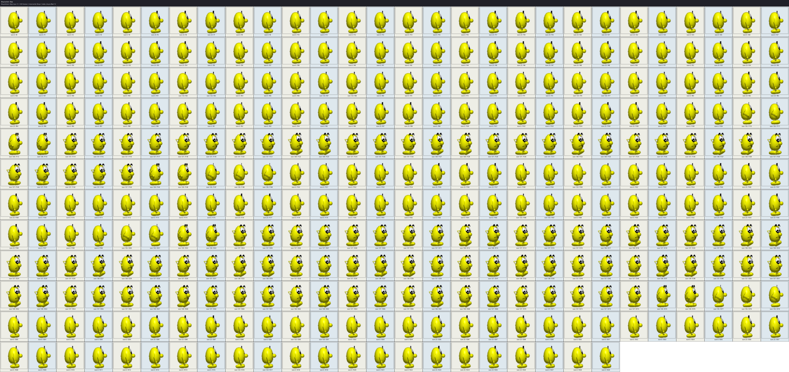

*`BlupiAction::Stop` (raw id 1): 330 animation frame(s), channel Blupi. Real sprite crop from
`blupi.png` via `Pixmap::GetSrcRectangle`; see `book/images/MANIFEST.md`.*

Blupi's default idle loop, and by a wide margin the largest single record in `table_blupi`. Most of
its 330 slots are the same standing pose; a handful of non-zero entries scattered through the cycle
are a short blink/fidget animation, timed to specific phase offsets that also trigger a blink sound
([Chapter 18](../part04-decor-simulation/ch18-blupi-actions-and-animation.md)).

### March — walking

*`BlupiAction::March` (raw id 2): 6 animation frame(s), channel Blupi.*

The ordinary walk cycle, paired with `Tables::table_vitesse_march`'s 4-phase speed curve
([Chapter 30](ch30-tables-animation-and-movement-data.md)) so faster phases correspond to the
foot-plant frames.

### StopMarch — transition to a stop
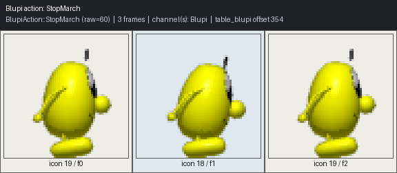

*`BlupiAction::StopMarch` (raw id 60): 3 animation frame(s), channel Blupi.*

A short deceleration flourish played when Blupi transitions from walking back to standing still.

### Turn
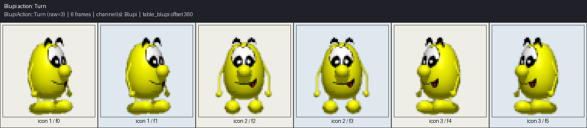

*`BlupiAction::Turn` (raw id 3): 6 animation frame(s), channel Blupi.*

Played whenever Blupi reverses facing direction on the ground; a plain loop with no freeze
threshold.

### Jump
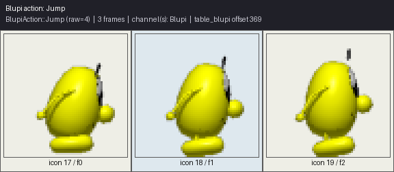

*`BlupiAction::Jump` (raw id 4): 3 animation frame(s), channel Blupi.*

The wind-up before becoming airborne; its 3-frame length matches `Config::ScaleTime(3)`, the exact
duration `BlupiStep()` waits before switching to `Air` ([Chapter 18](../part04-decor-simulation/ch18-blupi-actions-and-animation.md)).

### Air — falling/rising
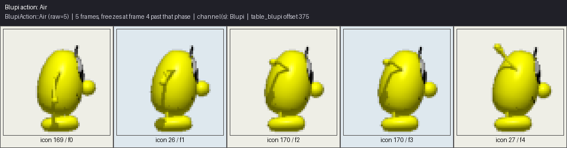

*`BlupiAction::Air` (raw id 5): 5 animation frame(s), freezes at frame 4 past that phase, channel
Blupi.*

Loops its rise-and-apex motion only while the airborne phase is 4 or under, then freezes on its
final frame for as long as Blupi keeps falling — the freeze-threshold mechanism explained in
[Chapter 30](ch30-tables-animation-and-movement-data.md).

### TurnAir — turning in mid-air
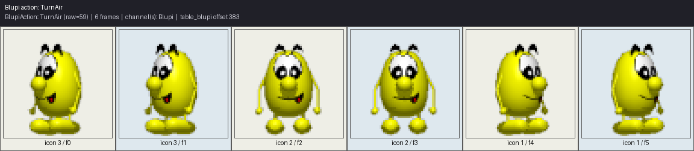

*`BlupiAction::TurnAir` (raw id 59): 6 animation frame(s), channel Blupi.*

`Turn`'s airborne counterpart, letting Blupi flip facing direction without landing first.

### StopJump / StopJumph — landing
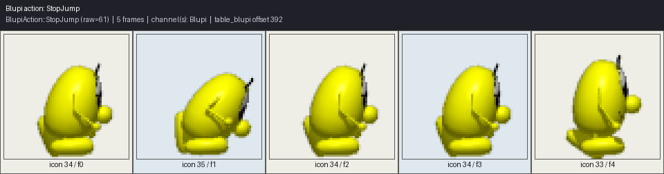

*`BlupiAction::StopJump` (raw id 61): 5 animation frame(s), channel Blupi.*

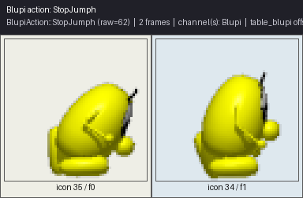

*`BlupiAction::StopJumph` (raw id 62): 2 animation frame(s), channel Blupi.*

Two variant landing recoveries — a longer 5-frame settle and a short 2-frame one — selected by
context in `BlupiStep()` ([Chapter 17](../part04-decor-simulation/ch17-blupi-state-machine.md)).

### Down / Up — crouching and standing back up
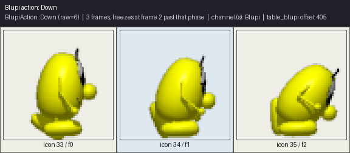

*`BlupiAction::Down` (raw id 6): 3 animation frame(s), freezes at frame 2 past that phase, channel
Blupi.*

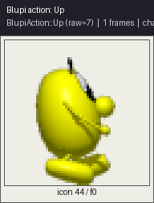

*`BlupiAction::Up` (raw id 7): 1 animation frame(s), channel Blupi.*

`Down` shows the freeze-threshold pattern at its smallest scale — play two frames, then hold;
`Up` is a single static pose, the shortest possible `table_blupi` record.

### Vertigo — teetering at an edge
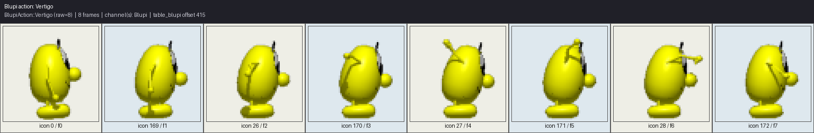

*`BlupiAction::Vertigo` (raw id 8): 8 animation frame(s), channel Blupi.*

Played when Blupi is standing at the edge of a drop while under wind ("vent") conditions —
`BlupiSearchIcon()` substitutes this in place of `Stop` specifically in that scenario
([Chapter 18](../part04-decor-simulation/ch18-blupi-actions-and-animation.md)).

### Recede / Advance — small step back and forward

*`BlupiAction::Recede` (raw id 9): 6 animation frame(s), channel Blupi.*

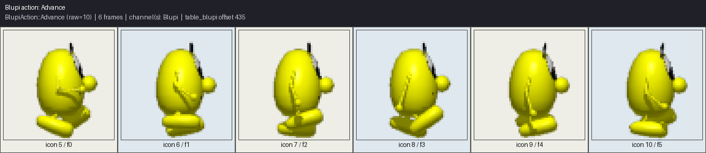

*`BlupiAction::Advance` (raw id 10): 6 animation frame(s), channel Blupi.*

The rendered counterparts of the queued `Recedeq`/`Advanceq` states named above — `BlupiStep()`
resolves the queued intent into one of these two before an animation frame is ever looked up.

### Hide — retreating from view
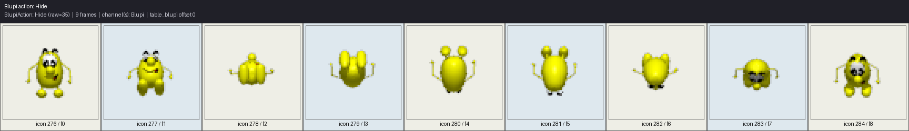

*`BlupiAction::Hide` (raw id 35): 9 animation frame(s), channel Blupi.*

The very first record in `table_blupi`'s raw data ([Chapter 30](ch30-tables-animation-and-movement-data.md));
played when Blupi uses the hide power-up (`ObjectType58`, [Chapter 32](ch32-creature-and-object-animation-catalog.md)).

## Win, carrying, and dynamite handling

### Win
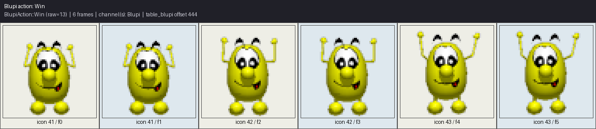

*`BlupiAction::Win` (raw id 13): 6 animation frame(s), channel Blupi.*

Played on reaching a level's exit goal ([Chapter 24](../part04-decor-simulation/ch24-missions-and-continuemission.md)).

### Push
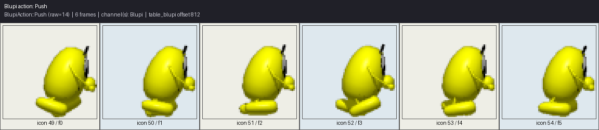

*`BlupiAction::Push` (raw id 14): 6 animation frame(s), channel Blupi.*

The generic pushing pose; also the substitution target for `March` under wind conditions
([Chapter 18](../part04-decor-simulation/ch18-blupi-actions-and-animation.md)).

### Pop / StopPop — popping an object into place
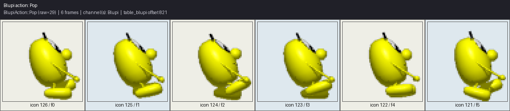

*`BlupiAction::Pop` (raw id 29): 6 animation frame(s), channel Blupi.*

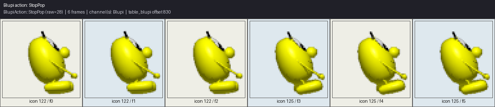

*`BlupiAction::StopPop` (raw id 28): 6 animation frame(s), channel Blupi.*

A moving and a stationary variant of the same box/crate-manipulation gesture.

### TakeDynamite / PutDynamite
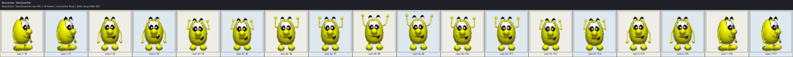

*`BlupiAction::TakeDynamite` (raw id 86): 18 animation frame(s), channel Blupi.*

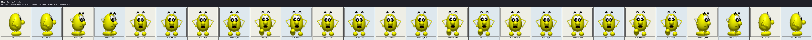

*`BlupiAction::PutDynamite` (raw id 87): 26 animation frame(s), channel Blupi.*

The two longest hand-animated (non-idle, non-freeze-loop) sequences in the whole catalog outside
the vehicle/hazard families — picking up a dynamite stick (`ObjectType55`) and placing it, the
prelude to the `ObjectType56` fuse sequence and the `table_explo1`-driven blast chain
([Chapters 32](ch32-creature-and-object-animation-catalog.md) and
[33](ch33-explosions-and-effects.md)).

## Death and hazard "Clear" animations

Eight `Clear*` actions are the death/hazard-defeat variants `BlupiDead()`
([Chapter 17](../part04-decor-simulation/ch17-blupi-state-machine.md)) chooses between depending on
the specific hazard.

### Clear1 — the general hazard death
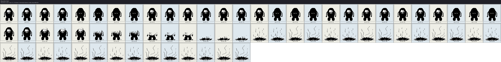

*`BlupiAction::Clear1` (raw id 11): 70 animation frame(s), channel Element.*

The most frequently used death animation, drawn from `PixmapChannel::Element` rather than `Blupi`
— one of the small set of actions [Chapter 18](../part04-decor-simulation/ch18-blupi-actions-and-animation.md)
identifies as sourced from the collectibles/effects atlas instead of Blupi's own sheet.

### Clear2 — falling into the void

*`BlupiAction::Clear2` (raw id 75): 1 animation frame(s), channel Element.*

A single static frame — the falling-off-the-map death is conveyed by Blupi's position leaving the
screen, not by an animated pose.

### Clear3 — lava
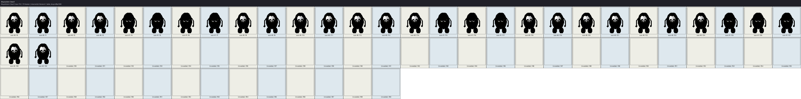

*`BlupiAction::Clear3` (raw id 76): 70 animation frame(s), channel Element.*

Immediately followed in the raw table data by the 43-entry padding run discussed above, before
`Clear4`'s real record begins.

### Clear4 — the saw
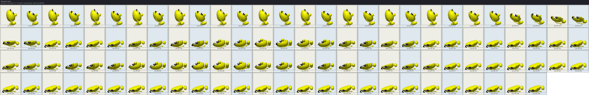

*`BlupiAction::Clear4` (raw id 77): 110 animation frame(s), channel Blupi.*

The longest of the eight `Clear` sequences, and drawn from `Blupi` rather than `Element` — unlike
its three numeric neighbors.

### Clear5, Clear6, Clear7, Clear8 — single-frame variants

*`BlupiAction::Clear5` (raw id 78): 1 animation frame(s), channel Blupi.*

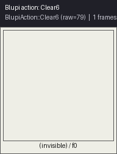

*`BlupiAction::Clear6` (raw id 79): 1 animation frame(s), channel Blupi.*

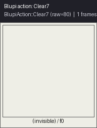

*`BlupiAction::Clear7` (raw id 80): 1 animation frame(s), channel Blupi.*

*`BlupiAction::Clear8` (raw id 81): 1 animation frame(s), channel Blupi.*

Four further hazard-death variants, each a single static pose rather than an animated sequence —
the visual variety across these eight deaths comes mostly from which single icon (or short cycle)
is shown, plus the surrounding hazard's own animation, rather than from elaborate per-death motion.

## Helicopter mode

### StopHelico / MarchHelico / TurnHelico
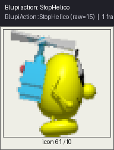

*`BlupiAction::StopHelico` (raw id 15): 1 animation frame(s), channel Blupi.*

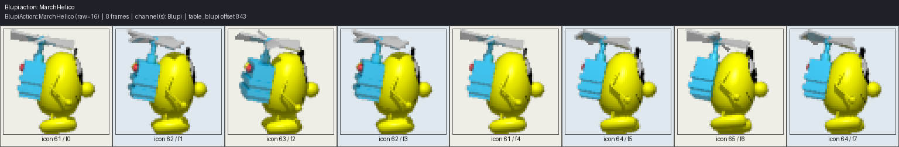

*`BlupiAction::MarchHelico` (raw id 16): 8 animation frame(s), channel Blupi.*

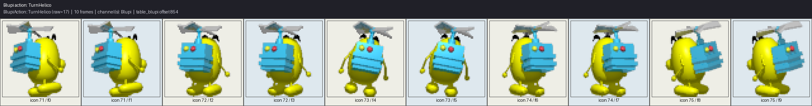

*`BlupiAction::TurnHelico` (raw id 17): 10 animation frame(s), channel Blupi.*

The full `Stop`/`March`/`Turn` triple for helicopter flight, substituted in whenever `m_blupiHelico`
is set ([Chapter 18](../part04-decor-simulation/ch18-blupi-actions-and-animation.md)). This mode
also drives `m_blupiRealRotation` from horizontal speed, tilting the sprite in flight.

## Overcraft/hover mode

### StopOver / MarchOver / TurnOver
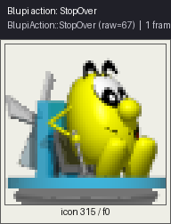

*`BlupiAction::StopOver` (raw id 67): 1 animation frame(s), channel Blupi.*

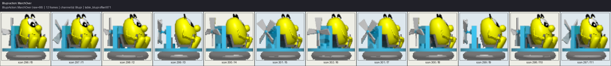

*`BlupiAction::MarchOver` (raw id 68): 12 animation frame(s), channel Blupi.*

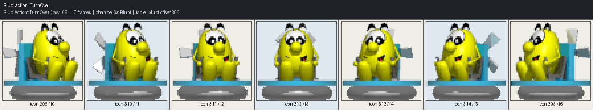

*`BlupiAction::TurnOver` (raw id 69): 7 animation frame(s), channel Blupi.*

The hover-craft/"overcraft" vehicle's own `Stop`/`March`/`Turn` triple, active while `m_blupiOver`
is set.

## Swimming

### StopNage / MarchNage / TurnNage
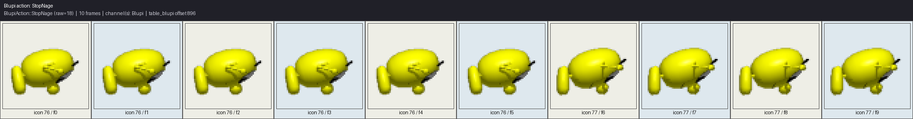

*`BlupiAction::StopNage` (raw id 18): 10 animation frame(s), channel Blupi.*

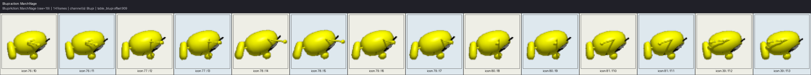

*`BlupiAction::MarchNage` (raw id 19): 14 animation frame(s), channel Blupi.*

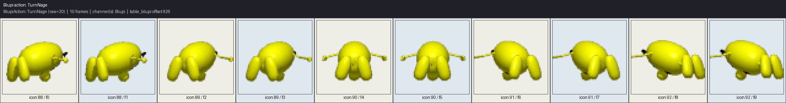

*`BlupiAction::TurnNage` (raw id 20): 10 animation frame(s), channel Blupi.*

Swimming's triple is paired with the `table_vitesse_nage` speed curve
([Chapter 30](ch30-tables-animation-and-movement-data.md)) and a runtime-computed tilt angle: eight
discrete rotation targets approached smoothly via `Misc::Approach()`, plus a continuous sine-wave
bob layered on top purely for a floating-in-water look
([Chapter 18](../part04-decor-simulation/ch18-blupi-actions-and-animation.md)).

## Surfing and drowning

### StopSurf / MarchSurf / TurnSurf

*`BlupiAction::StopSurf` (raw id 21): 12 animation frame(s), channel Blupi.*

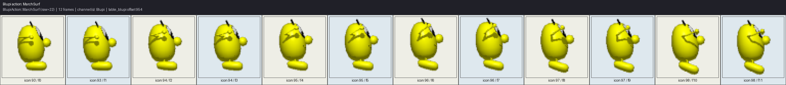

*`BlupiAction::MarchSurf` (raw id 22): 12 animation frame(s), channel Blupi.*

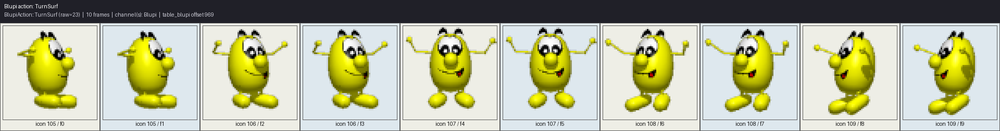

*`BlupiAction::TurnSurf` (raw id 23): 10 animation frame(s), channel Blupi.*

The surfboard's triple, with its own gentler, slower wobble than the swimming variant
(`sin(m_time / 10.0) * 10.0` versus swimming's `sin(m_time / 6.0) * 20.0`,
[Chapter 18](../part04-decor-simulation/ch18-blupi-actions-and-animation.md)).

### Drown
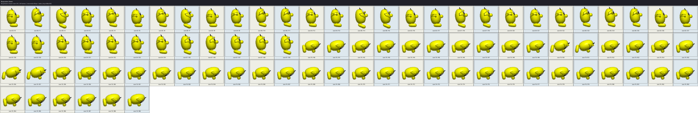

*`BlupiAction::Drown` (raw id 24): 90 animation frame(s), channel Blupi.*

The second-longest sequence in this catalog after `Stop`'s idle loop — a slow, deliberate 90-frame
sinking animation.

## Jeep vehicle

### StopJeep / MarchJeep / TurnJeep / Bye
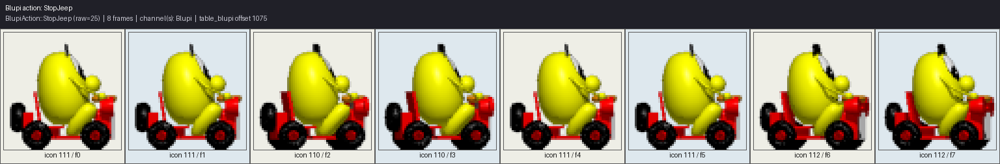

*`BlupiAction::StopJeep` (raw id 25): 8 animation frame(s), channel Blupi.*

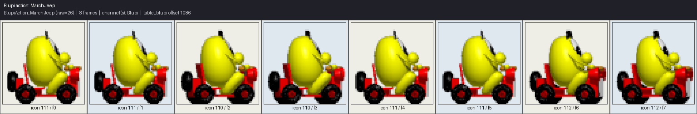

*`BlupiAction::MarchJeep` (raw id 26): 8 animation frame(s), channel Blupi.*

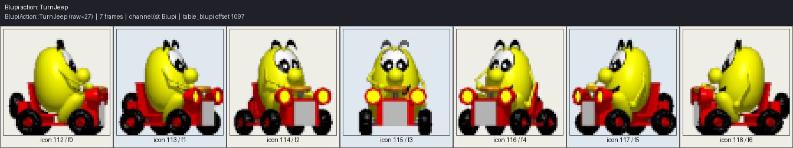

*`BlupiAction::TurnJeep` (raw id 27): 7 animation frame(s), channel Blupi.*

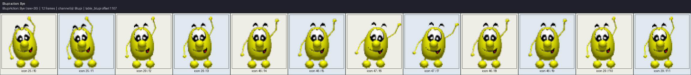

*`BlupiAction::Bye` (raw id 30): 12 animation frame(s), channel Blupi.*

The jeep's `Stop`/`March`/`Turn` triple, plus `Bye` — a farewell/departure wave played in specific
jeep-related scripted moments.

## Rope suspension

### StopSuspend / MarchSuspend / TurnSuspend / JumpSuspend
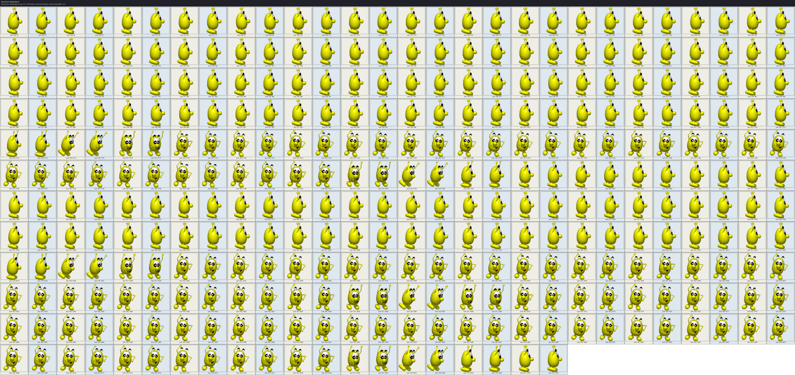

*`BlupiAction::StopSuspend` (raw id 31): 328 animation frame(s), channel Blupi.*

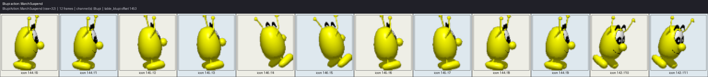

*`BlupiAction::MarchSuspend` (raw id 32): 12 animation frame(s), channel Blupi.*

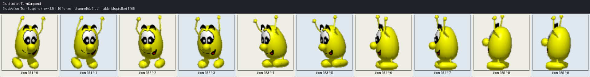

*`BlupiAction::TurnSuspend` (raw id 33): 10 animation frame(s), channel Blupi.*

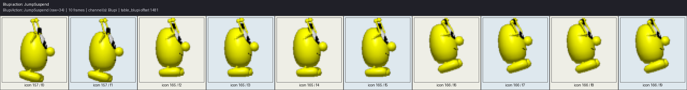

*`BlupiAction::JumpSuspend` (raw id 34): 10 animation frame(s), channel Blupi.*

`StopSuspend` is the second-largest record in the whole table (328 entries, almost matching
`Stop`'s 330) — an idle-hanging loop with its own long fidget cycle. This is also the one action
family with hardcoded left-facing exceptions to `table_mirror`
([Chapter 30](ch30-tables-animation-and-movement-data.md)): icons `144`, `143`, and `151` map to
`158`, `145`, and `146` respectively rather than through the generic mirror table, because the
rope-grip poses could not be produced by a simple horizontal flip.

## Ouch! — JumpAie

### JumpAie
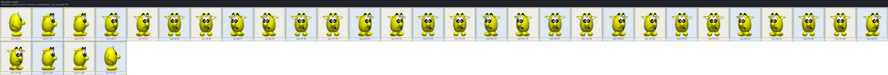

*`BlupiAction::JumpAie` (raw id 36): 32 animation frame(s), channel Blupi.*

A pained, flailing jump — played when Blupi is knocked airborne by a hazard rather than jumping
deliberately.

## Skateboard

### StopSkate / SlowdownSkate / MarchSkate / TurnSkate / JumpSkate / AirSkate
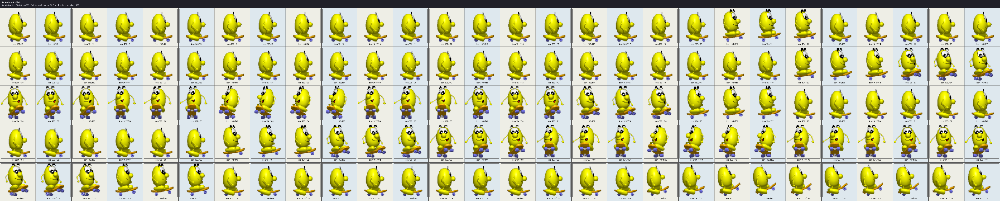

*`BlupiAction::StopSkate` (raw id 37): 140 animation frame(s), channel Blupi.*

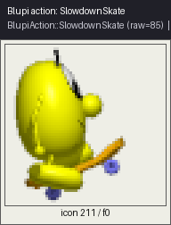

*`BlupiAction::SlowdownSkate` (raw id 85): 1 animation frame(s), channel Blupi.*

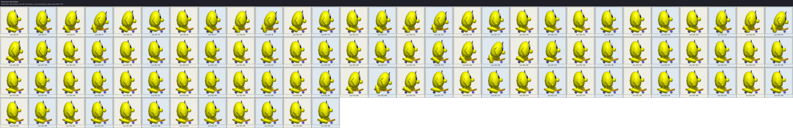

*`BlupiAction::MarchSkate` (raw id 38): 96 animation frame(s), channel Blupi.*

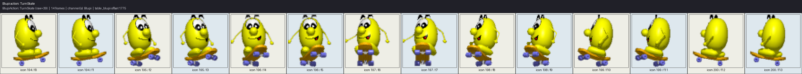

*`BlupiAction::TurnSkate` (raw id 39): 14 animation frame(s), channel Blupi.*

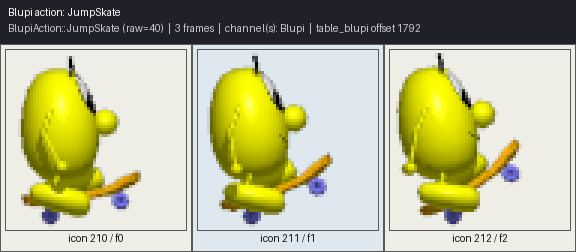

*`BlupiAction::JumpSkate` (raw id 40): 3 animation frame(s), channel Blupi.*

*`BlupiAction::AirSkate` (raw id 41): 8 animation frame(s), channel Blupi.*

The skateboard family is the largest single vehicle family in the catalog — six distinct states
covering idle, deceleration, rolling, turning, and jumping — reflecting the skateboard's more
elaborate movement model relative to the jeep or tank (`table_skate`'s own 34-frame wheel-spin
easing curve backs the rolling speed, [Chapter 30](ch30-tables-animation-and-movement-data.md)).

### TakeSkate / DeposeSkate

*`BlupiAction::TakeSkate` (raw id 42): 20 animation frame(s), channel Blupi.*

*`BlupiAction::DeposeSkate` (raw id 43): 20 animation frame(s), channel Blupi.*

Symmetric 20-frame mount/dismount sequences bookending the skateboard's use, played when Blupi picks
up `ObjectType24`'s skate collectible ([Chapter 32](ch32-creature-and-object-animation-catalog.md)).

## Relief: the Ouf* family and Sucette

Six near-miss "phew" relief animations, played after Blupi survives a close call, plus the
lollipop/suction-cup pose:

### Ouf1a / Ouf1b

*`BlupiAction::Ouf1a` (raw id 44): 29 animation frame(s), channel Blupi.*

*`BlupiAction::Ouf1b` (raw id 45): 29 animation frame(s), channel Blupi.*

Two equal-length variants of the same relief pose — [Chapter 18](../part04-decor-simulation/ch18-blupi-actions-and-animation.md)
notes `BlupiStep()` selects `Ouf1a` specifically after a near-miss while surfing or swimming.

### Ouf2 / Ouf3 / Ouf4 / Ouf5

*`BlupiAction::Ouf2` (raw id 46): 32 animation frame(s), channel Blupi.*

*`BlupiAction::Ouf3` (raw id 47): 34 animation frame(s), channel Blupi.*

*`BlupiAction::Ouf4` (raw id 48): 40 animation frame(s), channel Blupi.*

*`BlupiAction::Ouf5` (raw id 65): 44 animation frame(s), channel Blupi.*

Four further relief variants of increasing length, each presumably tied to a different specific
near-miss hazard type.

### Sucette

*`BlupiAction::Sucette` (raw id 49): 32 animation frame(s), channel Blupi.*

The suction-cup power-up pose, played on picking up `ObjectType26`
([Chapter 32](ch32-creature-and-object-animation-catalog.md)).

## Tank vehicle

### StopTank / MarchTank / TurnTank / FireTank

*`BlupiAction::StopTank` (raw id 50): 64 animation frame(s), channel Blupi.*

*`BlupiAction::MarchTank` (raw id 51): 8 animation frame(s), channel Blupi.*

*`BlupiAction::TurnTank` (raw id 52): 12 animation frame(s), channel Blupi.*

*`BlupiAction::FireTank` (raw id 53): 6 animation frame(s), channel Blupi.*

The tank's own `Stop`/`March`/`Turn` triple plus a dedicated firing pose — `StopTank`'s 64-frame
idle is far longer than any other vehicle's idle, likely encoding a turret-scanning idle animation.

## Hazards and special powers

### Glu — stuck in glue

*`BlupiAction::Glu` (raw id 54): 25 animation frame(s), channel Element.*

Drawn from `Element` rather than `Blupi`, matching `ObjectType34`'s goo/glue particle animation
table of the same length ([Chapter 32](ch32-creature-and-object-animation-catalog.md)).

### Drink

*`BlupiAction::Drink` (raw id 55): 4 animation frame(s), channel Blupi.*

The shortest of the power-up poses, played on picking up `ObjectType30`.

### Charge

*`BlupiAction::Charge` (raw id 56): 64 animation frame(s), channel Blupi.*

Played while the power-charge cheat/power-up is active (`Tables::CheatCodes::PowerCharge`,
[Chapter 23](../part04-decor-simulation/ch23-secret-powers-and-cheat-system.md)).

### Electro — electrocution

*`BlupiAction::Electro` (raw id 57): 90 animation frame(s), channel Blupi/Element.*

The one `BlupiAction` sequence that changes `PixmapChannel` *mid-animation*: icons below `266` draw
from `Element`, the rest from `Blupi` ([Chapter 18](../part04-decor-simulation/ch18-blupi-actions-and-animation.md)) —
a 90-frame length matching `table_electro`'s own animation-effect table exactly
([Chapter 30](ch30-tables-animation-and-movement-data.md)).

### Switch

*`BlupiAction::Switch` (raw id 82): 10 animation frame(s), channel Blupi.*

Played when Blupi activates a switch/lever tile.

### HelicoGlu

*`BlupiAction::HelicoGlu` (raw id 58): 14 animation frame(s), channel Blupi.*

A helicopter/glue hybrid state — Blupi's helicopter caught in glue.

### Balloon

*`BlupiAction::Balloon` (raw id 66): 16 animation frame(s), channel Blupi.*

Played while the balloon vehicle pick-up (`ObjectType46`) is active; its expiry spawns the
`table_explo6` burst effect ([Chapter 33](ch33-explosions-and-effects.md)).

## Crush (Ecrase)

### StopEcrase / MarchEcrase

*`BlupiAction::StopEcrase` (raw id 72): 1 animation frame(s), channel Blupi.*

*`BlupiAction::MarchEcrase` (raw id 73): 24 animation frame(s), channel Blupi.*

The "crush shield" state (`m_blupiEcrase`) that lets Blupi survive being flattened by a crusher tile
for a limited time; its expiry spawns the `table_explo5` electric-spark burst
([Chapter 33](ch33-explosions-and-effects.md)).

## Teleport

### Teleporte

*`BlupiAction::Teleporte` (raw id 74): 128 animation frame(s), channel Blupi.*

The third-longest sequence in the catalog, matching `table_explo7`'s 128-frame length
([Chapter 30](ch30-tables-animation-and-movement-data.md)) — both are driven by the same teleporter
event, one animating Blupi, the other the `table_explo7`-driven energy-arc visual effect spawned
alongside it ([Chapter 33](ch33-explosions-and-effects.md)).

## Enemy mockery

### Mockery / Mockeryi / Mockeryp

*`BlupiAction::Mockery` (raw id 63): 92 animation frame(s), channel Blupi.*

*`BlupiAction::Mockeryi` (raw id 64): 104 animation frame(s), channel Blupi.*

*`BlupiAction::Mockeryp` (raw id 83): 60 animation frame(s), channel Blupi.*

Three lengthy taunt/mockery poses played when a nearby enemy provokes Blupi
([Chapter 20](../part04-decor-simulation/ch20-enemy-and-creature-ai.md)); `Mockeryi` at 104 frames
is the single longest hand-animated sequence in this entire catalog outside `Stop`'s idle loop.

### Non — refusal/head-shake

*`BlupiAction::Non` (raw id 84): 18 animation frame(s), channel Blupi.*

A "no" head-shake gesture, the final entry in `table_blupi`'s data before the table's terminating
`0`.

## Quick-reference table: all 84 sequences

The table below collects every action's raw id, frame count, and channel in one place for quick
lookup — the same data as every caption above, reordered by raw `BlupiAction` id (the enum's own
declaration order, [Chapter 18](../part04-decor-simulation/ch18-blupi-actions-and-animation.md))
rather than this chapter's thematic grouping, so a reader who already knows an action's numeric id
from a debugger or a save-file dump can find it directly.

| Raw id | Action | `table_blupi` offset | Frames | Channel |
|---|---|---|---|---|
| 1 | Stop | 12 | 330 | Blupi |
| 2 | March | 345 | 6 | Blupi |
| 3 | Turn | 360 | 6 | Blupi |
| 4 | Jump | 369 | 3 | Blupi |
| 5 | Air | 375 | 5 (freeze @4) | Blupi |
| 6 | Down | 405 | 3 (freeze @2) | Blupi |
| 7 | Up | 411 | 1 | Blupi |
| 8 | Vertigo | 415 | 8 | Blupi |
| 9 | Recede | 426 | 6 | Blupi |
| 10 | Advance | 435 | 6 | Blupi |
| 11 | Clear1 | 503 | 70 | Element |
| 13 | Win | 444 | 6 | Blupi |
| 14 | Push | 812 | 6 | Blupi |
| 15 | StopHelico | 839 | 1 | Blupi |
| 16 | MarchHelico | 843 | 8 | Blupi |
| 17 | TurnHelico | 854 | 10 | Blupi |
| 18 | StopNage | 896 | 10 | Blupi |
| 19 | MarchNage | 909 | 14 | Blupi |
| 20 | TurnNage | 926 | 10 | Blupi |
| 21 | StopSurf | 939 | 12 | Blupi |
| 22 | MarchSurf | 954 | 12 | Blupi |
| 23 | TurnSurf | 969 | 10 | Blupi |
| 24 | Drown | 982 | 90 | Blupi |
| 25 | StopJeep | 1075 | 8 | Blupi |
| 26 | MarchJeep | 1086 | 8 | Blupi |
| 27 | TurnJeep | 1097 | 7 | Blupi |
| 28 | StopPop | 830 | 6 | Blupi |
| 29 | Pop | 821 | 6 | Blupi |
| 30 | Bye | 1107 | 12 | Blupi |
| 31 | StopSuspend | 1122 | 328 | Blupi |
| 32 | MarchSuspend | 1453 | 12 | Blupi |
| 33 | TurnSuspend | 1468 | 10 | Blupi |
| 34 | JumpSuspend | 1481 | 10 | Blupi |
| 35 | Hide | 0 | 9 | Blupi |
| 36 | JumpAie | 1494 | 32 | Blupi |
| 37 | StopSkate | 1529 | 140 | Blupi |
| 38 | MarchSkate | 1676 | 96 | Blupi |
| 39 | TurnSkate | 1775 | 14 | Blupi |
| 40 | JumpSkate | 1792 | 3 | Blupi |
| 41 | AirSkate | 1798 | 8 | Blupi |
| 42 | TakeSkate | 1809 | 20 | Blupi |
| 43 | DeposeSkate | 1832 | 20 | Blupi |
| 44 | Ouf1a | 1855 | 29 | Blupi |
| 45 | Ouf1b | 1887 | 29 | Blupi |
| 46 | Ouf2 | 1919 | 32 | Blupi |
| 47 | Ouf3 | 1954 | 34 | Blupi |
| 48 | Ouf4 | 1991 | 40 | Blupi |
| 49 | Sucette | 2081 | 32 | Blupi |
| 50 | StopTank | 2116 | 64 | Blupi |
| 51 | MarchTank | 2183 | 8 | Blupi |
| 52 | TurnTank | 2194 | 12 | Blupi |
| 53 | FireTank | 2209 | 6 | Blupi |
| 54 | Glu | 2218 | 25 | Element |
| 55 | Drink | 2246 | 4 | Blupi |
| 56 | Charge | 2253 | 64 | Blupi |
| 57 | Electro | 2320 | 90 | Blupi/Element |
| 58 | HelicoGlu | 2426 | 14 | Blupi |
| 59 | TurnAir | 383 | 6 | Blupi |
| 60 | StopMarch | 354 | 3 | Blupi |
| 61 | StopJump | 392 | 5 | Blupi |
| 62 | StopJumph | 400 | 2 | Blupi |
| 63 | Mockery | 2624 | 92 | Blupi |
| 64 | Mockeryi | 2719 | 104 | Blupi |
| 65 | Ouf5 | 2034 | 44 | Blupi |
| 66 | Balloon | 2443 | 16 | Blupi |
| 67 | StopOver | 867 | 1 | Blupi |
| 68 | MarchOver | 871 | 12 | Blupi |
| 69 | TurnOver | 886 | 7 | Blupi |
| 72 | StopEcrase | 2462 | 1 | Blupi |
| 73 | MarchEcrase | 2466 | 24 | Blupi |
| 74 | Teleporte | 2493 | 128 | Blupi |
| 75 | Clear2 | 576 | 1 | Element |
| 76 | Clear3 | 580 | 70 | Element |
| 77 | Clear4 | 683 | 110 | Blupi |
| 78 | Clear5 | 796 | 1 | Blupi |
| 79 | Clear6 | 800 | 1 | Blupi |
| 80 | Clear7 | 804 | 1 | Blupi |
| 81 | Clear8 | 808 | 1 | Blupi |
| 82 | Switch | 2413 | 10 | Blupi |
| 83 | Mockeryp | 2826 | 60 | Blupi |
| 84 | Non | 2889 | 18 | Blupi |
| 85 | SlowdownSkate | 1672 | 1 | Blupi |
| 86 | TakeDynamite | 453 | 18 | Blupi |
| 87 | PutDynamite | 474 | 26 | Blupi |

Four `BlupiAction` raw ids are conspicuously absent from this list, exactly as this chapter's
opening section established: `0` (`None`), `12` (`Set`), `70` (`Recedeq`), and `71` (`Advanceq`) —
declared enum values with no corresponding `table_blupi` record and no rendered sequence.

## See also

- [Chapter 17 — Blupi: the State Machine](../part04-decor-simulation/ch17-blupi-state-machine.md)
- [Chapter 18 — Blupi Actions and Animation](../part04-decor-simulation/ch18-blupi-actions-and-animation.md)
- [Chapter 20 — Enemy and Creature AI](../part04-decor-simulation/ch20-enemy-and-creature-ai.md)
- [Chapter 23 — Secret Powers and the Cheat System](../part04-decor-simulation/ch23-secret-powers-and-cheat-system.md)
- [Chapter 29 — The Sprite Atlas System](ch29-sprite-atlas-system.md)
- [Chapter 30 — Tables: Animation and Movement Data](ch30-tables-animation-and-movement-data.md)
- [Chapter 32 — The Creature and Object Animation Catalog](ch32-creature-and-object-animation-catalog.md)
- [Chapter 33 — Explosions and Effects](ch33-explosions-and-effects.md)
- [Appendix B — Enum Catalog](../appendices/appendix-b-enum-catalog.md)
- [Appendix G — Screenshot and Visual Gallery](../appendices/appendix-g-screenshot-gallery.md)
