# Chapter 32: The Creature and Object Animation Catalog

## Scope: the visual catalog, not the AI

`Decor::MoveObjectStepIcon()` ([Chapter 30](ch30-tables-animation-and-movement-data.md)) is the one
function that decides which sprite every non-Blupi moving object shows each frame — sometimes via a
`Tables::table_*` lookup, sometimes via a bare inline formula like `icon = 12 + phase % 9`. This
chapter is the illustrated companion to that function: every `object-*.png` contact sheet in
`book/images/MANIFEST.md`, organized by visual family, each captioned with its real `ObjectType`
number, name, and source formula. **This is a visual catalog, not a behavior guide** — for how
these creatures patrol, chase, or react to Blupi, see
[Chapter 19](../part04-decor-simulation/ch19-moving-objects-and-decor-actions.md) (moving objects
and decor actions) and [Chapter 20](../part04-decor-simulation/ch20-enemy-and-creature-ai.md)
(enemy and creature AI); this chapter deliberately does not re-explain that logic.

All sprites in this chapter are cropped from `object-m.png`, `Content/icons/`'s largest atlas
(1301×1431 pixels, 64×64 grid, 1px gap — [Chapter 29](ch29-sprite-atlas-system.md)), addressed
through `PixmapChannel::Object` or `PixmapChannel::Element` depending on the specific object, per
each caption below.

## Patrol enemies — ground walkers

### ObjectType2 — standard patrolling enemy
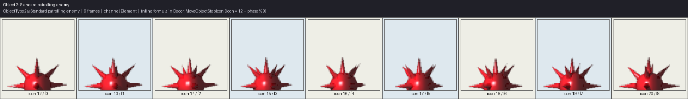

*ObjectType2 (Standard patrolling enemy): 9 frame(s), channel Element. Source: inline formula in
`Decor::MoveObjectStepIcon` — `icon = 12 + phase % 9`.*

### ObjectType3 — patrolling enemy variant
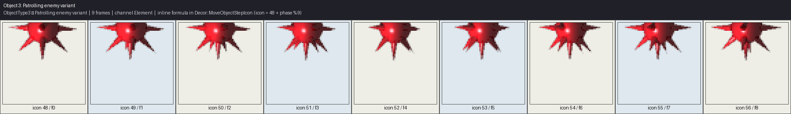

*ObjectType3 (Patrolling enemy variant): 9 frame(s), channel Element. Source: inline formula —
`icon = 48 + phase % 9`.*

Both are computed directly in `Decor::MoveObjectStepIcon()` without any named `Tables::table_*`
array — the simplest possible animation-driving pattern in the entire object system: a base icon
offset plus a modulo-cycling phase counter, no lookup table needed at all.

### ObjectType16 — spider/arthropod enemy
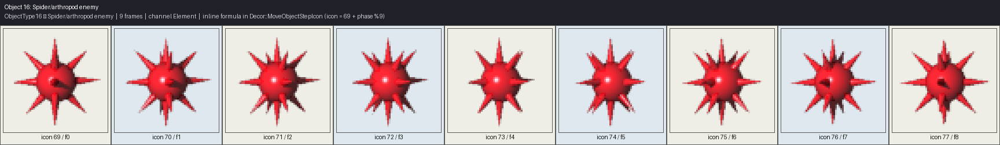

*ObjectType16 (Spider/arthropod enemy): 9 frame(s), channel Element. Source: inline formula —
`icon = 69 + phase % 9`.*

## Follow enemies

### ObjectType96 / ObjectType97 — enemies that track Blupi directly
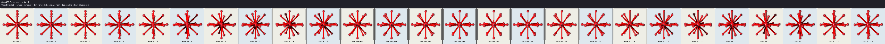

*ObjectType96 (Follow enemy variant 1): 26 frame(s), channel Element. Source: `Tables::table_follow1`.*

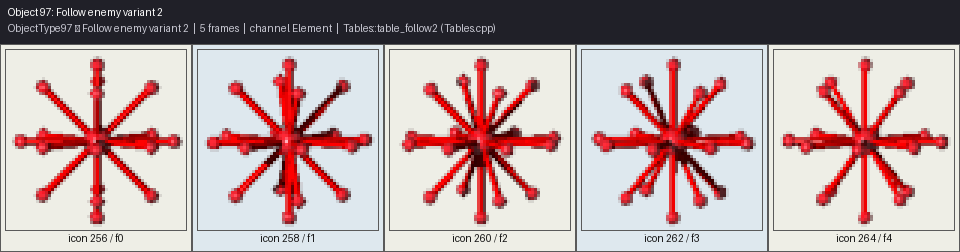

*ObjectType97 (Follow enemy variant 2): 5 frame(s), channel Element. Source: `Tables::table_follow2`.*

Unlike the plain patrol enemies above, these two are table-driven — `table_follow1`'s far longer
26-frame cycle versus `table_follow2`'s abbreviated 5-frame one suggests two distinct
pursuit-intensity variants sharing the same underlying "track Blupi's position" AI
([Chapter 20](../part04-decor-simulation/ch20-enemy-and-creature-ai.md)).

## Bulldozer

### ObjectType4 — four sub-animations
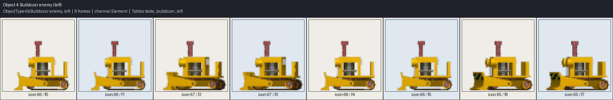

*ObjectType4 (Bulldozer enemy), 'left' sub-animation: 8 frame(s), channel Element. Source:
`Tables::table_bulldozer_left`.*

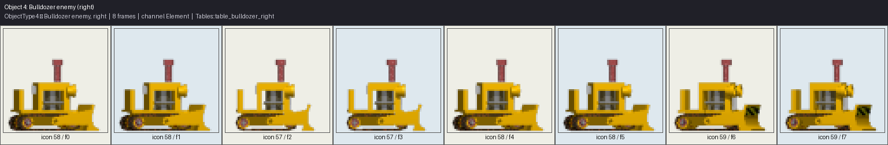

*ObjectType4 (Bulldozer enemy), 'right' sub-animation: 8 frame(s), channel Element. Source:
`Tables::table_bulldozer_right`.*

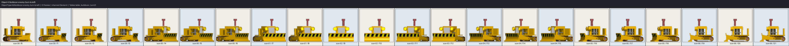

*ObjectType4 (Bulldozer enemy), 'turn-to-left' sub-animation: 22 frame(s), channel Element. Source:
`Tables::table_bulldozer_turn2l`.*

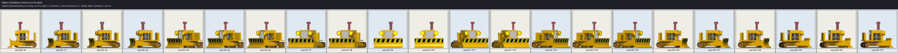

*ObjectType4 (Bulldozer enemy), 'turn-to-right' sub-animation: 22 frame(s), channel Element. Source:
`Tables::table_bulldozer_turn2r`.*

The bulldozer is the first of five creature types in this catalog that follow the identical
four-table shape [Chapter 30](ch30-tables-animation-and-movement-data.md) documents: short looping
`_left`/`_right` cycles for straight-line movement, and much longer `_turn2l`/`_turn2r` sequences
(here, nearly triple the length) for the direction-reversal flourish.

## Fish

### ObjectType17 — four sub-animations
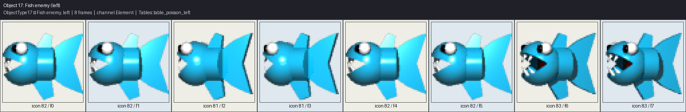

*ObjectType17 (Fish enemy), 'left' sub-animation: 8 frame(s), channel Element. Source:
`Tables::table_poisson_left`.*

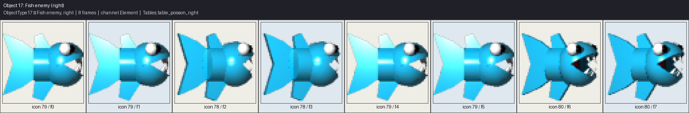

*ObjectType17 (Fish enemy), 'right' sub-animation: 8 frame(s), channel Element. Source:
`Tables::table_poisson_right`.*

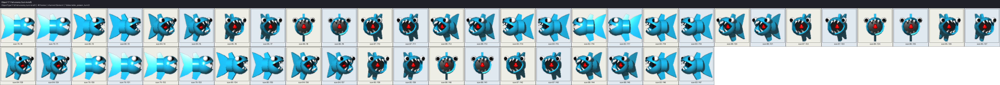

*ObjectType17 (Fish enemy), 'turn-to-left' sub-animation: 48 frame(s), channel Element. Source:
`Tables::table_poisson_turn2l`.*

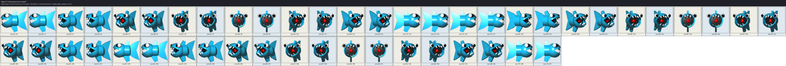

*ObjectType17 (Fish enemy), 'turn-to-right' sub-animation: 48 frame(s), channel Element. Source:
`Tables::table_poisson_turn2r`.*

The fish's turn sequences are the second-longest of any creature's turn-transition family in this
catalog (48 frames — six times its own 8-frame swim cycle), consistent with a fish visibly arcing
its whole body through a wide turning curve rather than snapping instantly to the new heading.

## Birds

### ObjectType20 — four sub-animations
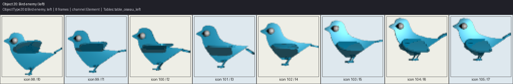

*ObjectType20 (Bird enemy), 'left' sub-animation: 8 frame(s), channel Element. Source:
`Tables::table_oiseau_left`.*

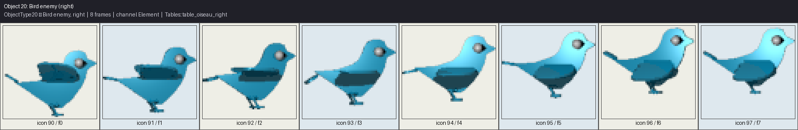

*ObjectType20 (Bird enemy), 'right' sub-animation: 8 frame(s), channel Element. Source:
`Tables::table_oiseau_right`.*

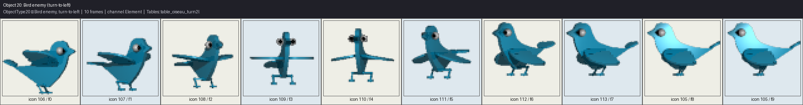

*ObjectType20 (Bird enemy), 'turn-to-left' sub-animation: 10 frame(s), channel Element. Source:
`Tables::table_oiseau_turn2l`.*

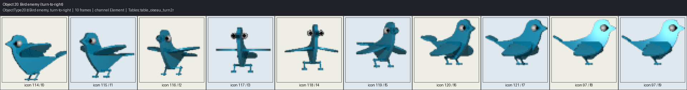

*ObjectType20 (Bird enemy), 'turn-to-right' sub-animation: 10 frame(s), channel Element. Source:
`Tables::table_oiseau_turn2r`.*

Birds have the shortest turn-transition sequences (10 frames) of any of the four-table creature
families — a quick bank rather than a long arcing turn, fitting a bird's faster, more agile flight
compared to a fish's or bulldozer's turn.

## Wasps

### ObjectType44 — four sub-animations
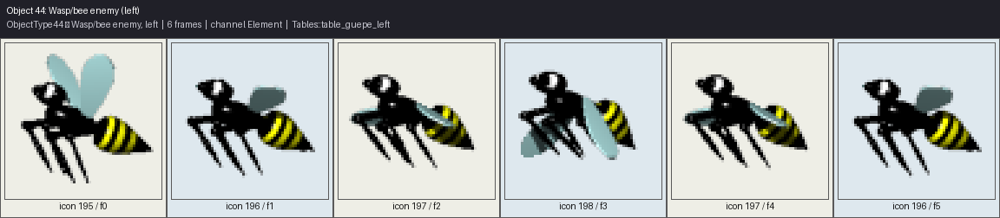

*ObjectType44 (Wasp/bee enemy), 'left' sub-animation: 6 frame(s), channel Element. Source:
`Tables::table_guepe_left`.*

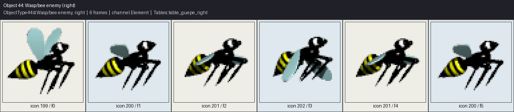

*ObjectType44 (Wasp/bee enemy), 'right' sub-animation: 6 frame(s), channel Element. Source:
`Tables::table_guepe_right`.*

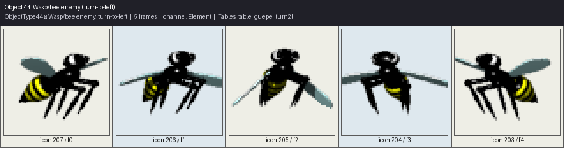

*ObjectType44 (Wasp/bee enemy), 'turn-to-left' sub-animation: 5 frame(s), channel Element. Source:
`Tables::table_guepe_turn2l`.*

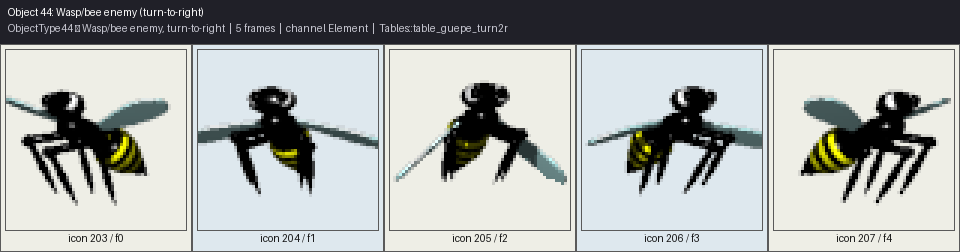

*ObjectType44 (Wasp/bee enemy), 'turn-to-right' sub-animation: 5 frame(s), channel Element. Source:
`Tables::table_guepe_turn2r`.*

The wasp has the shortest cycle *and* the shortest turn (6 and 5 frames respectively) of any
creature in this catalog — a fast wing-beat that reads correctly even at a very small frame count,
consistent with the wasp being the fastest, most erratic patrol enemy in the game
([Chapter 20](../part04-decor-simulation/ch20-enemy-and-creature-ai.md)).

## Large creature

### ObjectType54 — three sheets (shared turn table)
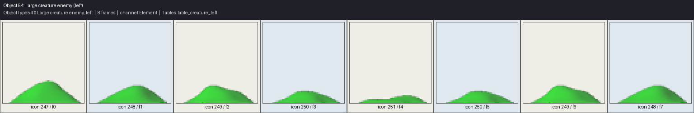

*ObjectType54 (Large creature enemy), 'left' sub-animation: 8 frame(s), channel Element. Source:
`Tables::table_creature_left`.*

*ObjectType54 (Large creature enemy), 'right' sub-animation: 8 frame(s), channel Element. Source:
`Tables::table_creature_right`.*

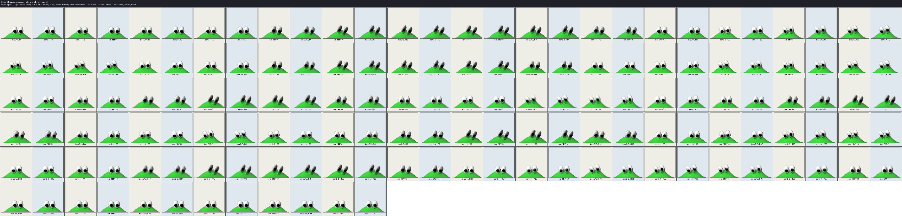

*ObjectType54 (Large creature enemy), 'turn-to-left / turn-to-right' sub-animation (single table
shared by both turn directions): 152 frame(s), channel Element. Source:
`Tables::table_creature_turn2`.*

The large creature is the one exception to the "four separate tables" shape: both turn directions
share a single 152-frame `table_creature_turn2` table — by far the longest turn-transition sequence
of any creature in this catalog, an elaborate, slow pulsing turn befitting its role as a
helicopter-destroying hazard ([Chapter 20](../part04-decor-simulation/ch20-enemy-and-creature-ai.md)).

## Blupi-hostile clones: "blupih" and "blupit"

### ObjectType32 — "blupih"
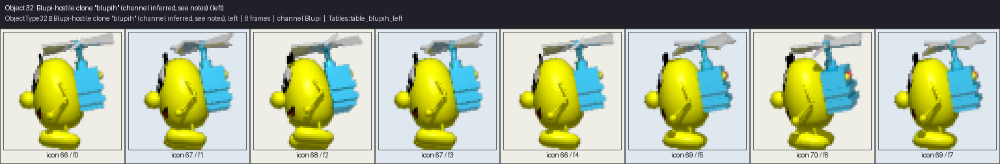

*ObjectType32 (Blupi-hostile clone "blupih" (channel inferred, see notes)), 'left' sub-animation:
8 frame(s), channel Blupi. Source: `Tables::table_blupih_left`.*

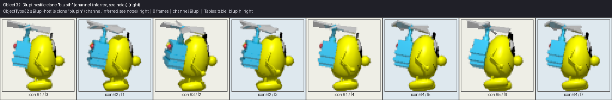

*ObjectType32, 'right' sub-animation: 8 frame(s), channel Blupi. Source: `Tables::table_blupih_right`.*

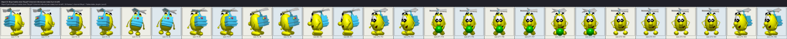

*ObjectType32, 'turn-to-left' sub-animation: 26 frame(s), channel Blupi. Source:
`Tables::table_blupih_turn2l`.*

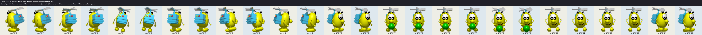

*ObjectType32, 'turn-to-right' sub-animation: 26 frame(s), channel Blupi. Source:
`Tables::table_blupih_turn2r`.*

### ObjectType33 — "blupit"
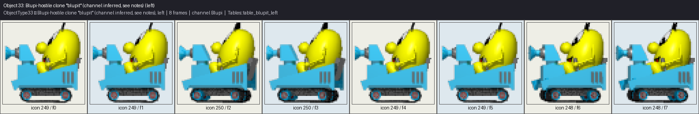

*ObjectType33 (Blupi-hostile clone "blupit" (channel inferred, see notes)), 'left' sub-animation:
8 frame(s), channel Blupi. Source: `Tables::table_blupit_left`.*

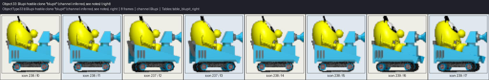

*ObjectType33, 'right' sub-animation: 8 frame(s), channel Blupi. Source: `Tables::table_blupit_right`.*

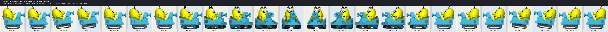

*ObjectType33, 'turn-to-left' sub-animation: 24 frame(s), channel Blupi. Source:
`Tables::table_blupit_turn2l`.*

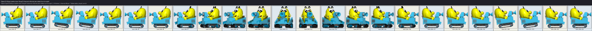

*ObjectType33, 'turn-to-right' sub-animation: 24 frame(s), channel Blupi. Source:
`Tables::table_blupit_turn2r`.*

Both clone types are drawn on `PixmapChannel::Blupi` — but, as flagged precisely in
[Chapter 30](ch30-tables-animation-and-movement-data.md), `Decor::MoveObjectStepIcon()` never
assigns an explicit `PixmapChannel` for either `ObjectType32` or `ObjectType33` the way it does for
every other creature in this chapter. The `Blupi` channel used here is a reasoned inference — every
icon value both table families produce (`61`–`70` for "blupih", `237`–`250` for "blupit") falls
inside `blupi.png`'s addressable range, and both table names mirror the Blupi asset family's naming
convention — not a directly observed assignment. `ObjectType32` fires a single `ObjectType23`
projectile during its turn animation; `ObjectType33` fires two, at phase 3 and phase 21 of its turn
(`decor/ObjectType.hpp:176-177`) — [Chapter 20](../part04-decor-simulation/ch20-enemy-and-creature-ai.md)
covers this projectile behavior itself.

## Collectibles

### ObjectType5 — treasure
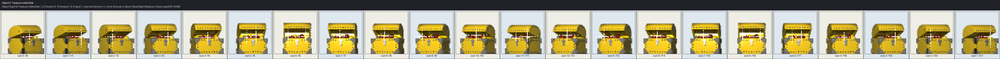

*ObjectType5 (treasure collectible): 22-frame forward/backward sweep over icons 0-10, channel
Element. Source: inline ping-pong formula in `Decor::MoveObjectStepIcon` (`Decor.cpp:8297-8308`).*

The one collectible in this catalog animated by a hand-written ping-pong sweep rather than a plain
modulo loop or a table lookup — the sequence advances forward through icons 0–10, then reverses back
down to 0, for a 22-step round trip.

### ObjectType6 — life egg
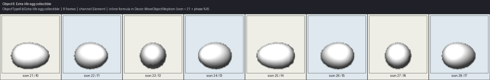

*ObjectType6 (Extra-life egg collectible): 8 frame(s), channel Element. Source: inline formula —
`icon = 21 + phase % 8`.*

### ObjectType7 — exit goal marker
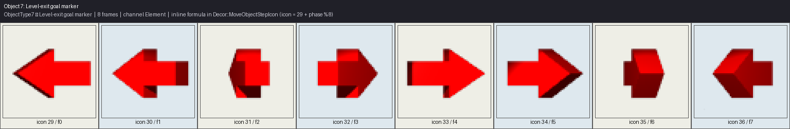

*ObjectType7 (Level-exit goal marker): 8 frame(s), channel Element. Source: inline formula —
`icon = 29 + phase % 8`.*

### ObjectType21 — secret exit key
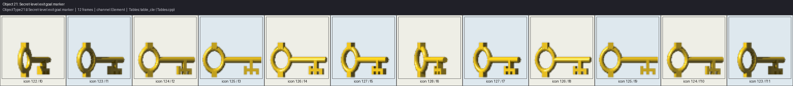

*ObjectType21 (Secret-level exit goal marker): 12 frame(s), channel Element. Source:
`Tables::table_cle`.*

### ObjectType49 / 50 / 51 — the three colored keys
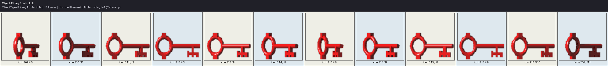

*ObjectType49 (Key 1 collectible): 12 frame(s), channel Element. Source: `Tables::table_cle1`.*

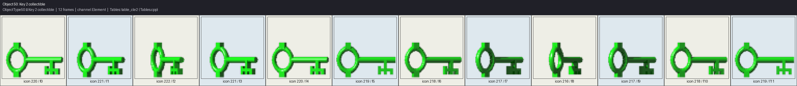

*ObjectType50 (Key 2 collectible): 12 frame(s), channel Element. Source: `Tables::table_cle2`.*

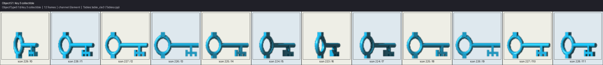

*ObjectType51 (Key 3 collectible): 12 frame(s), channel Element. Source: `Tables::table_cle3`.*

Each key corresponds to one `DoorKeyFlags` bit ([Chapter 22](../part04-decor-simulation/ch22-doors-keys-doorkeyflags.md));
all four key-family spin cycles (the generic `table_cle` plus the three colored variants) share the
identical 12-frame length, differing only in which specific icons they spin through.

## Power-ups

### ObjectType24 — skate pickup
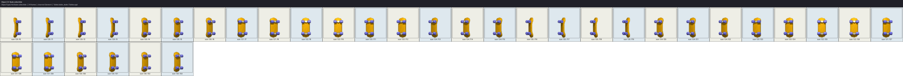

*ObjectType24 (Skate collectible): 34 frame(s), channel Element. Source: `Tables::table_skate`.*

### ObjectType25 — shield pickup
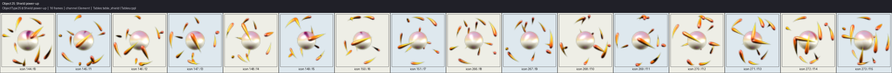

*ObjectType25 (Shield power-up): 16 frame(s), channel Element. Source: `Tables::table_shield`.*

### ObjectType26 — suction-cup power
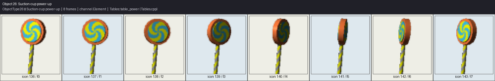

*ObjectType26 (Suction-cup power-up): 8 frame(s), channel Element. Source: `Tables::table_power`.*

### ObjectType31 — charge/cloud power-up
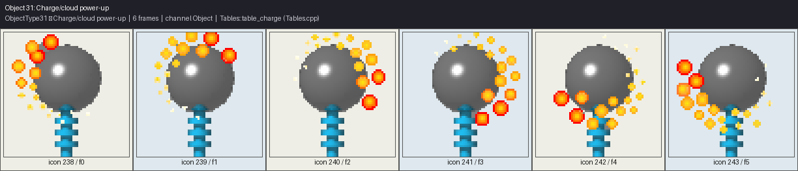

*ObjectType31 (Charge/cloud power-up): 6 frame(s), channel Object. Source: `Tables::table_charge`.*

### ObjectType40 — mirror/invert power-up
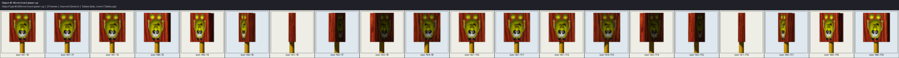

*ObjectType40 (Mirror/invert power-up): 20 frame(s), channel Element. Source: `Tables::table_invert`.*

`ObjectType31` is the one power-up pickup in this group drawn from `PixmapChannel::Object` rather
than `Element` — every other collectible and power-up in this chapter uses `Element`.
[Chapter 23](../part04-decor-simulation/ch23-secret-powers-and-cheat-system.md) covers what each
power-up actually does once collected.

## Trail and sparkle effects

### ObjectType27 — magic track
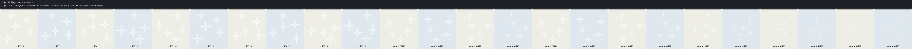

*ObjectType27 (Magic track sparkle trail): 24 frame(s), channel Element. Source:
`Tables::table_magictrack`.*

### ObjectType57 — shield track
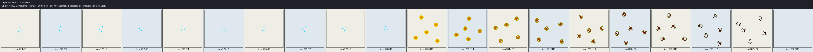

*ObjectType57 (Shield trail sparkle): 20 frame(s), channel Element. Source:
`Tables::table_shieldtrack`.*

### ObjectType39 — treasure track
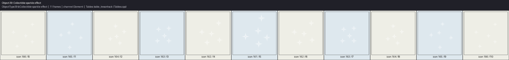

*ObjectType39 (Collectible sparkle effect): 11 frame(s), channel Element. Source:
`Tables::table_tresortrack`.*

All three are short-lived visual trails spawned alongside a specific power-up or collectible pickup
— `Decor::MoveObjectStep()` auto-expires each of them once their phase counter exceeds their own
frame count ([Chapter 30](ch30-tables-animation-and-movement-data.md)'s auto-despawn pattern).

## Construction and mechanism animations

### ObjectType52 — bridge construction
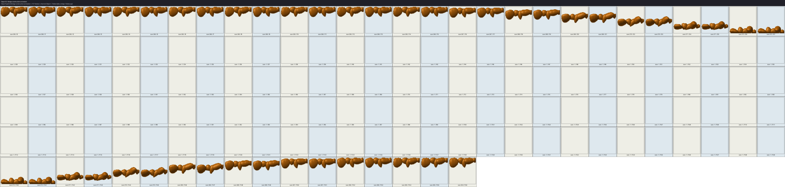

*ObjectType52 (Bridge construction animation): 157 frame(s), channel Object. Source:
`Tables::table_bridge`.*

The single longest animation table in this entire catalog — 157 frames, encoding an extend phase,
a long invisible hold section, and a retract phase back to the folded-bridge icon
([Chapter 30](ch30-tables-animation-and-movement-data.md)'s header-comment description of
`table_bridge`'s structure). `ObjectType52` also uniquely updates the *static* decor tile at its
start position simultaneously with its own animation (`decor/ObjectType.hpp:187`).

### ObjectType56 — dynamite fuse
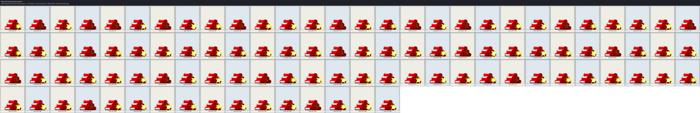

*ObjectType56 (Dynamite fuse animation): 100 frame(s), channel Element. Source:
`Tables::table_dynamitef`.*

A pseudo-random-looking but entirely baked-in 100-frame fuse-flicker sequence
([Chapter 30](ch30-tables-animation-and-movement-data.md)), which triggers multiple
`DynamiteStart()` blasts between phases 50–69 (`decor/ObjectType.hpp:188`) — the animation and the
actual explosion timing are driven by the same phase counter but are logically separate concerns,
covered from the explosion side in [Chapter 33](ch33-explosions-and-effects.md).

## Water effects

### ObjectType14 — water plouf
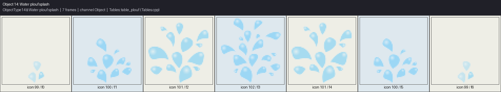

*ObjectType14 (Water plouf splash): 7 frame(s), channel Object. Source: `Tables::table_plouf`.*

### ObjectType15 — water bubble
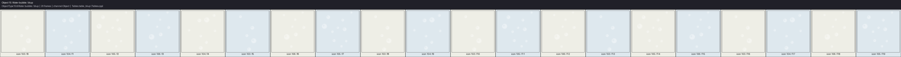

*ObjectType15 (Water bubble / blup): 20 frame(s), channel Object. Source: `Tables::table_blup`.*

### ObjectType35 — small plouf (a genuine array-bounds inconsistency)

*ObjectType35 (Small plouf splash): 3 frame(s), channel Object. Source: `Tables::table_tiplouf`.*

This last sheet documents a real, verified quirk rather than glossing over it: `Decor.cpp:8619`
indexes `table_tiplouf` **modulo 7**, but `Tables.cpp` declares `table_tiplouf` with only 3 real
elements (`{244, 99, 244}`). This is a genuine array-bounds inconsistency in the original engine,
carried through the port unchanged — the sheet above renders exactly the 3 real elements the table
actually contains and does not fabricate frames 3–6 to paper over the gap (`book/images/MANIFEST.md`'s
own honesty note on this file states the same finding independently).

## Goo, pollution, and other particle effects

### ObjectType34 — goo/glue particle

*ObjectType34 (Goo/glue particle): 25 frame(s), channel Element. Source: `Tables::table_glu`.*

Shares its exact frame count with `BlupiAction::Glu`'s 25-frame sequence
([Chapter 31](ch31-blupi-animation-catalog.md)) — the tile-side glue effect and Blupi's own
stuck-in-glue pose are visually synchronized by using tables of identical length.

### ObjectType36 — pollution/cloud puff

*ObjectType36 (Pollution/cloud puff effect): 8 frame(s), channel Element. Source:
`Tables::table_pollution`.*

### ObjectType37 — clear/dissipate effect

*ObjectType37 (Clear/dissipate visual effect): 70 frame(s), channel Element. Source:
`Tables::table_clear`.*

### ObjectType38 — electric arc

*ObjectType38 (electric arc effect): 90 frames, channel switches from Blupi1_12 to Element partway
through the sequence (`Decor.cpp:8988-9006`). Source: `Tables::table_electro`, drawing from
`blupi1.png` for frames 0–29 and `element.png` for frames 30–89.*

`ObjectType38` is the one sequence in this entire catalog confirmed to genuinely use `blupi1.png` —
[Chapter 29](ch29-sprite-atlas-system.md) noted that `blupi1.png` exists as a full, separate atlas
but is otherwise unreferenced by any `table_blupi`-driven `BlupiAction`; this effect's first 30
frames are the one real exception, before the sequence switches to `Element` for its remaining 60
frames.

### ObjectType41 / ObjectType42 — invert start/stop bursts

*ObjectType41 (Invert-start particle burst): 8 frame(s), channel Element. Source:
`Tables::table_invertstart`.*

*ObjectType42 (Invert-stop particle burst): 8 frame(s), channel Element. Source:
`Tables::table_invertstop`.*

Symmetric activation/deactivation bursts for the invert power-up (`table_invertstop` is documented
as literally the reverse playback order of `table_invertstart`'s frames,
[Chapter 30](ch30-tables-animation-and-movement-data.md)).

## Channel distribution across the catalog

Counting every sheet in this chapter by its `PixmapChannel` gives a picture that is close to a
mirror image of [Chapter 31](ch31-blupi-animation-catalog.md)'s own finding for Blupi's own
animations. Of the 58 contact sheets above, the large majority (44) draw from
`PixmapChannel::Element`, a small group of exactly 5 draw from `PixmapChannel::Object`
(`ObjectType14`'s water plouf, `ObjectType15`'s water bubble, `ObjectType31`'s charge cloud,
`ObjectType35`'s small plouf, and `ObjectType52`'s bridge construction), 8 draw from
`PixmapChannel::Blupi` — every one of the last group belonging to the "blupih"/"blupit" clone pair
whose channel is itself an inference rather than a directly observed assignment, as noted above —
and exactly 1 (`ObjectType38`'s electric arc) genuinely switches channel mid-sequence, from
`Blupi1_12` to `Element`. This skews the opposite way from
[Chapter 31](ch31-blupi-animation-catalog.md), where `Blupi` was overwhelmingly dominant (79 of 84
sequences) and `Element` the small exception (4 sequences) — a sensible division of labor between
the two atlases: `blupi.png` is essentially reserved for Blupi's own body, and `element.png` is the
default home for everything else that needs to be a small, animated, in-world sprite (creatures,
collectibles, particle effects), while `object-m.png` (`PixmapChannel::Object`) is reserved for a
small set of specifically larger or more elaborate constructions — the bridge, the two water-splash
variants, and the charge-cloud power-up among them.

## Objects outside this catalog's scope: doors, avatars, and the unidentified range

Two further real, active `ObjectType` values genuinely animate but fall outside this chapter's
sprite-catalog scope for reasons worth stating precisely rather than silently omitting:

- **`ObjectType22`** — an animated door-opening sequence, spawned directly by `Decor::OpenDoor()`
  and removed once its animation phase reaches step 3 (`decor/ObjectType.hpp:185`). It is a real,
  table-free, hand-coded animation living inside the doors/keys mechanism rather than the generic
  `MoveObjectStepIcon()` dispatch this chapter otherwise catalogs — [Chapter 22](../part04-decor-simulation/ch22-doors-keys-doorkeyflags.md)
  is where its behavior belongs.
- **`ObjectType200`–`203`** — the Blupi avatar/costume-select variants, drawing icons `257`–`262`
  from `PixmapChannel::Blupi`/`Blupi1_11`/`Blupi1_12`/`Blupi1_13` respectively
  (`decor/ObjectType.hpp:197-200`). These are visually just Blupi himself (or a recolored variant)
  rather than a distinct creature or effect sprite, so they belong conceptually with
  [Chapter 31](ch31-blupi-animation-catalog.md)'s subject matter even though they are technically
  `ObjectType` values, not `BlupiAction` values — `ObjectType201`/`202`/`203` are also, as
  [Chapter 29](ch29-sprite-atlas-system.md) noted, the confirmed real users of the `Blupi1_11`/`12`/`13`
  channel identities that share the otherwise-underused `blupi1.png` texture.

Beyond these, `ObjectType.hpp`'s own header comment is direct about a large swath of declared but
unverified values: "IDs that are not mentioned anywhere in `Decor.cpp` (42–203 with many gaps) are
either unused in the current levels or are placeholders reserved for future use. Their semantics are
unknown" (`decor/ObjectType.hpp:18-21`). Concretely, that means roughly 100 of the 204 declared
`ObjectType` enumerators (`43`, `45`, `59`–`89`, `94`–`95`, and `101`–`199`) are declared purely to
keep the enum's numeric range contiguous for lossless level-file round-tripping, with no confirmed
animation, behavior, or even existence anywhere in `Decor.cpp`'s logic — this catalog naturally
covers none of them, since there is no real data anywhere to extract a sprite from. This is a
meaningfully large "unknown" region of the game's own object-type space, honestly labeled as such in
the source itself rather than guessed at here.

## Objects with no contact sheet: static single-icon draws

Seven `ObjectType` values in `Decor::MoveObjectStepIcon()` draw a single, unchanging icon every
frame rather than cycling through a sequence, and are therefore correctly excluded from this
catalog's contact sheets — there is no sequence to show:

| ObjectType | Role | Icon | Channel |
|---|---|---|---|
| 13 | Helicopter pick-up | 68 | Element |
| 19 | Jeep vehicle pick-up | 89 | Element |
| 23 | Fired projectile | 176 | Element |
| 28 | Tank vehicle pick-up | 167 | Element |
| 29 | Bullet ammo pack | 177 | Element |
| 30 | Drink power-up | 178 | Element |
| 46 | Balloon vehicle pick-up | 208 | Element |

All seven are confirmed by direct inspection of `Decor::MoveObjectStepIcon()`'s inline constant
assignments — each is a single hardcoded icon number, not a table lookup or a modulo formula. A
player still sees these objects animate indirectly, in the sense that they move, bob, or get picked
up, but the *sprite itself* never changes frame while active.

## See also

- [Chapter 19 — Moving Objects and Decor Actions](../part04-decor-simulation/ch19-moving-objects-and-decor-actions.md)
- [Chapter 20 — Enemy and Creature AI](../part04-decor-simulation/ch20-enemy-and-creature-ai.md)
- [Chapter 22 — Doors, Keys, DoorKeyFlags](../part04-decor-simulation/ch22-doors-keys-doorkeyflags.md)
- [Chapter 23 — Secret Powers and the Cheat System](../part04-decor-simulation/ch23-secret-powers-and-cheat-system.md)
- [Chapter 29 — The Sprite Atlas System](ch29-sprite-atlas-system.md)
- [Chapter 30 — Tables: Animation and Movement Data](ch30-tables-animation-and-movement-data.md)
- [Chapter 31 — The Blupi Animation Catalog](ch31-blupi-animation-catalog.md)
- [Chapter 33 — Explosions and Effects](ch33-explosions-and-effects.md)
- [Appendix B — Enum Catalog](../appendices/appendix-b-enum-catalog.md)
