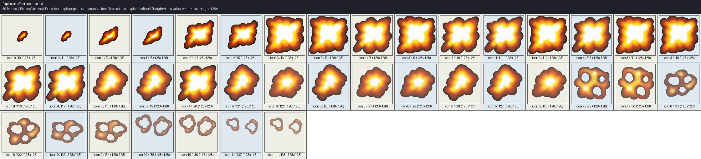
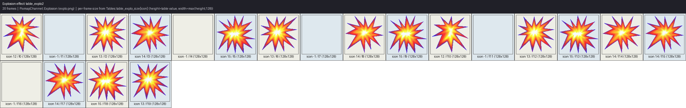
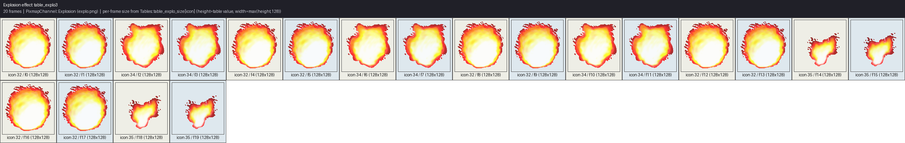
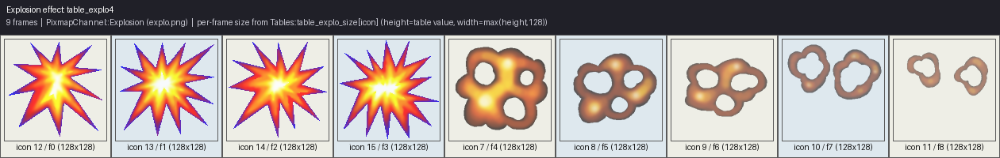
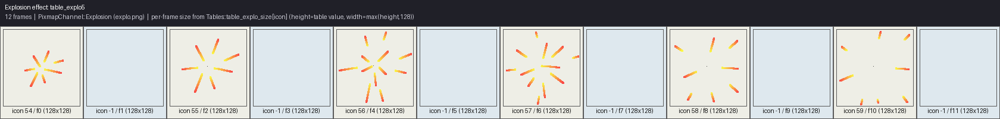
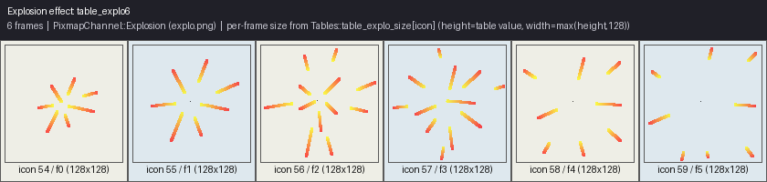
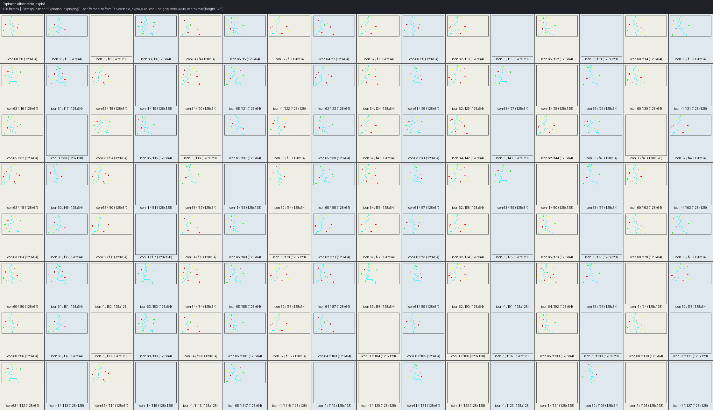
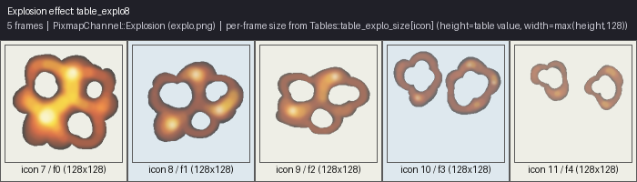

# Chapter 33: Explosions and Effects

## Eight tables, eight real gameplay triggers

[Chapter 30](ch30-tables-animation-and-movement-data.md) established the data format shared by
`Tables::table_explo1` through `table_explo8`: each is a flat icon sequence on the `Explosion`
channel (`explo.png`), played once by a dedicated `ObjectType` (`8`–`11` and `90`–`93`) that
self-despawns the instant its phase counter exceeds the table's length. This chapter completes the
picture with the one thing the data format alone cannot show: *which specific gameplay event spawns
each one*. Every trigger below is confirmed directly from real `ObjectStart(..., ObjectType::ObjectTypeN, ...)`
call sites in `Decor.cpp` — not inferred from the table numbering or trusted uncritically from the
`ObjectType` enum's own doc comments, several of which turn out to describe only one of several real
trigger sites, or in one case a different trigger than the enum comment itself suggests.

## table_explo1 — the general-purpose blast (`ObjectType8`)



*Explosion/effect sequence `table_explo1`: 39 frame(s), each cropped at its own real per-icon size
from `table_explo_size`.*

This is the most heavily reused of the eight explosion effects, spawned from at least four distinct
real call sites in `Decor.cpp`:

- **The `CleanAll` cheat** (`Tables::CheatCodes::CleanAll`), which converts every live patrol enemy,
  bulldozer, spider, fish, bird, wasp, large creature, and blupih/blupit clone in the level directly
  into an `ObjectType8` explosion in place (`Decor.cpp:1793-1819`) — an instant "clear the board"
  effect.
- **Killing a ground/flying patrol enemy by contact** (any of `ObjectType2`/`3`/`96`/`97`/`4`, but
  specifically *not* the fish/bird pair, which use `table_explo3` instead — see below):
  `Decor.cpp:5807-5816`.
- **A follower-type enemy (`ObjectType4`/`32`/`33`) reaching another moving object and detonating on
  contact**, inside `Decor::MoveObjectStep()`'s own inline handling for those three enemy types
  (`Decor.cpp:7957-7973`).
- **Every individual blast of a dynamite chain**, in `Decor::DynamiteStart()`
  (`Decor.cpp:9058-9071`) — the function's own doc comment confirms this precisely: "It spawns an
  explosion sprite (`ObjectType8`) at the (dx,dy) offset, and only the central blast (`dx==dy==0`)
  also plays the boom sound and triggers the screen shake."

`table_explo1` is, in short, the game's default "something died or blew up here" visual — reused
across cheat cleanup, ordinary enemy kills, follower-enemy collisions, and every dynamite blast
alike, rather than each of those events getting its own dedicated effect table.

## table_explo2 — the vehicle-dismount poof (`ObjectType9`)



*Explosion/effect sequence `table_explo2`: 20 frame(s), each cropped at its own real per-icon size
from `table_explo_size`.*

Every real call site for `ObjectType9` fires when Blupi is forcibly dismounted from a
vehicle/flight mode:

- Landing on a spring ("ressort") tile while riding the helicopter, overcraft, jeep, tank, or
  skateboard — each vehicle gets its own near-identical `if` block, all spawning `ObjectType9` at
  the dismount point (`Decor.cpp:2837-2892`).
- The helicopter being forced down by hitting a ceiling while Blupi has camera focus
  (`Decor.cpp:5261-5274`).
- Any vehicle mode (helicopter, overcraft, jeep, tank, skateboard) ending because Blupi flew or
  drove into surf or deep water (`Decor.cpp:5415-5428`).
- A vehicle sinking after the projectile-caused enemy encounter at `Decor.cpp:8055-8064`.

Every one of these is conceptually the same event — "Blupi's ride just ended, abruptly" — which is
exactly why a single small 20-frame poof effect covers all of them regardless of *which* vehicle was
involved.

## table_explo3 — enemy contact death, flying/aquatic variant (`ObjectType10`)



*Explosion/effect sequence `table_explo3`: 20 frame(s), each cropped at its own real per-icon size
from `table_explo_size`.*

Two real trigger sites, both enemy-contact deaths, but specifically the fish/bird pair and the large
creature — a different, slightly larger effect than the `table_explo1` poof used for ground patrol
enemies:

- Killing a fish (`ObjectType17`) or bird (`ObjectType20`) by contact (`Decor.cpp:5797-5806`),
  distinguished in the same `if`/`else` block from the ground-enemy case that uses `table_explo1`
  instead.
- The large creature (`ObjectType54`) destroying Blupi's vehicle when it makes contact while Blupi
  is riding one (`Decor.cpp:5894-5897`).

## table_explo4 — the fan-hit shockwave (`ObjectType11`)



*Explosion/effect sequence `table_explo4`: 9 frame(s), each cropped at its own real per-icon size
from `table_explo_size`.*

A single, unambiguous trigger: touching a "Ventillo" fan-hazard tile (`Decor::IsVentillo()`), which
both kills Blupi (`BlupiDead(BlupiAction::Clear1, BlupiAction::Clear2)`) if he has camera focus and
unconditionally spawns this shockwave effect plus a `DecorAction::BigShake` screen shake
(`Decor.cpp:5459-5469`) — the shortest of the eight tables at only 9 frames, appropriate for a sharp,
instantaneous shock rather than a lingering effect.

## table_explo5 — electric spark burst (`ObjectType90`)



*Explosion/effect sequence `table_explo5`: 12 frame(s), each cropped at its own real per-icon size
from `table_explo_size`.*

The `ObjectType` enum's own doc comment describes this as "spawned on electric contact, triggers
`ElectricShake`" (`decor/ObjectType.hpp:145`) — accurate for one of its three real trigger sites, but
not the only one. Reading every real `ObjectStart(..., ObjectType::ObjectType90, ...)` call site
directly:

- **The "crush shield" (`m_blupiEcrase`) expiring** after its timer runs out, restoring normal
  gravity to Blupi (`Decor.cpp:5182-5196`) — no `ElectricShake` here; this site sets no explicit
  `m_decorAction` shake at all.
- **The invert power-up's related shield timing out** at a separate call site
  (`Decor.cpp:5582-5591`), which does trigger `DecorAction::BigShake`, not `ElectricShake`.
- **A wasp (`ObjectType44`) hitting Blupi and converting him into balloon mode**
  (`Decor.cpp:5826-5865`), the one site that genuinely does set `DecorAction::ElectricShake` —
  matching the enum comment, but only for this specific trigger among the three.

`table_explo5` is therefore best understood as a general "shield/protection state just ended"
visual, used across three distinct expiring-buff scenarios that happen to share the same effect,
rather than an exclusively "electric" effect as its doc comment alone would suggest.

## table_explo6 — the small flash (`ObjectType91`)



*Explosion/effect sequence `table_explo6`: 6 frame(s), each cropped at its own real per-icon size
from `table_explo_size`.*

Two confirmed real trigger sites, both tied to the balloon vehicle specifically:

- **The balloon vehicle's own shield-timer expiring** (`m_blupiBalloon` timeout,
  `Decor.cpp:5165-5175`).
- **The balloon popping on contact with a follow-type or patrol creature** (`ObjectType3`/`16`/`96`/`97`,
  `Decor.cpp:5766-5781`).

At only 6 frames, this is the second-shortest table in the family — a quick, small pop rather than
a sustained burst, fitting the "balloon just popped" moment it represents in both real trigger
contexts.

## table_explo7 — the long energy arc (`ObjectType92`)



*Explosion/effect sequence `table_explo7`: 128 frame(s), each cropped at its own real per-icon size
from `table_explo_size`.*

Here the `ObjectType` enum's doc comment ("spawned when Blupi uses a charged attack,"
`decor/ObjectType.hpp:147`) does not match the one real trigger site found by grepping every
`ObjectStart(..., ObjectType::ObjectType92, ...)` call in `Decor.cpp`. The actual trigger is
teleportation:

*From `Decor.cpp:5593-5606`:*
```cpp
if (IsTeleporte(m_blupiPos) != -1 && !m_blupiHelico && !m_blupiOver && !m_blupiBalloon && !m_blupiEcrase &&
    !m_blupiJeep && !m_blupiTank && !m_blupiSkate && !m_blupiAir && m_blupiFocus && m_blupiPosHelico.X == -1)
{
    m_blupiAction = BlupiAction::Teleporte;
    m_blupiPhase = 0;
    // ...
    PlaySound(SoundChannel::SoundChannel71, m_blupiPos);
    celSwitch.X = m_blupiPos.X;
    celSwitch.Y = m_blupiPos.Y - 5;
    ObjectStart(celSwitch, ObjectType::ObjectType92, 0);
}
```

`table_explo7`'s 128-frame length exactly matches `BlupiAction::Teleporte`'s own 128-frame animation
([Chapter 31](ch31-blupi-animation-catalog.md)) — the two are clearly a matched pair, one animating
Blupi's own sprite through the teleport, the other rendering the surrounding energy-arc visual
effect for the identical duration. This is the longest of the eight explosion tables by a wide
margin (128 frames versus the next-longest at 39), consistent with a teleport being a much longer,
more elaborate event than an instantaneous blast or pop.

## table_explo8 — the tiny flash / travel-trail spark (`ObjectType93`)



*Explosion/effect sequence `table_explo8`: 5 frame(s), each cropped at its own real per-icon size
from `table_explo_size`.*

The shortest table in the family (5 frames), used for the smallest, most incidental visual moment
of the eight. Its one confirmed real trigger site is not a hazard or a vehicle event at all, but a
UI/HUD flourish inside `Decor::VoyageDraw()` — the routine that animates a collected item flying
across the screen (the "voyage" sequence, e.g. after completing a level segment):

*From `Decor.cpp:10332-10346`:*
```cpp
if (m_voyageIcon == 40 && m_voyageChannel == PixmapChannel::Element)
{
    int array[7] = {-8, -6, -4, 0, 4, 6, 8};
    pos.X -= 34;
    pos.X += m_posDecor.X;
    pos.Y += m_posDecor.Y;
    int num2 = array[m_random.get()->Next(0, 6)];
    int num3 = m_random.get()->Next(-10, 10);
    if (num == 0)
    {
        num2 /= 2;
        num3 *= 4;
    }
    pos.Y += num3;
    ObjectStart(pos, ObjectType::ObjectType93, num2);
}
```

Specifically for `m_voyageIcon == 40` on the `Element` channel — one particular flying-icon voyage
sequence — a small random-offset trail spark is spawned behind the flying icon on every frame,
using `m_random` to jitter both its horizontal drift (`num2`) and vertical position (`num3`). This
is a decorative particle-trail effect, not a hazard or death effect like the other seven, and the
`ObjectType` enum's own doc comment ("Tiny flash effect," `decor/ObjectType.hpp:148`) undersells its
actual role as a randomized trailing-sparkle behind one specific flying collectible animation.

## Summary: all eight tables at a glance

| Table | `ObjectType` | Frames | Real trigger(s) confirmed in `Decor.cpp` |
|---|---|---|---|
| `table_explo1` | 8 | 39 | `CleanAll` cheat cleanup; ground-enemy contact kill; follower-enemy collision; every dynamite blast |
| `table_explo2` | 9 | 20 | Forced vehicle dismount (spring/ressort landing, ceiling collision, entering water while riding) |
| `table_explo3` | 10 | 20 | Fish/bird contact kill; large-creature vehicle-destroying contact |
| `table_explo4` | 11 | 9 | Touching a Ventillo fan hazard tile |
| `table_explo5` | 90 | 12 | Crush-shield ("ecrase") timeout; a related shield timeout; wasp contact converting Blupi to balloon mode |
| `table_explo6` | 91 | 6 | Balloon-vehicle timeout; balloon popping on creature contact |
| `table_explo7` | 92 | 128 | Teleporter use (paired with `BlupiAction::Teleporte`'s identical 128-frame length) |
| `table_explo8` | 93 | 5 | `VoyageDraw()`'s flying-collectible trail spark (icon 40, `Element` channel) |

Two structural patterns fall out of this table once all eight are seen together. First, **frame
count correlates with event duration rather than event severity**: the shortest table (`table_explo8`,
5 frames) covers the most trivial, cosmetic event (a decorative trail spark), while the longest by
far (`table_explo7`, 128 frames) covers the single most elaborate scripted sequence in the family
(a full teleport), and the fan-hit shockwave (`table_explo4`, 9 frames) — arguably the single
instantly-fatal hazard among the eight — is nonetheless one of the shortest, because the underlying
event itself is instantaneous. Second, **several tables cover more than one conceptually similar but
mechanically distinct trigger**: `table_explo1` alone is reused across four unrelated call sites
(a cheat, an ordinary kill, a follower-enemy collision, and a dynamite blast) because all four share
the same "a moving object or enemy has just been removed from the level" visual need, regardless of
what specifically removed it.

## What this confirms about the `table_explo_size` per-icon crop

Every one of the eight contact sheets above was cropped using each icon's own real size from
`Tables::table_explo_size`, not a uniform 144×144 cell — [Chapter 29](ch29-sprite-atlas-system.md)
documented this as the one channel where `GetSrcRectangle()`'s stride and its returned rectangle
size genuinely diverge. The visibly non-uniform frame sizes within a single contact sheet above
(most conspicuously in `table_explo7`'s 128-frame sequence) are real data, not an extraction
artifact — `table_explo_size`'s handful of `144`-valued entries (channels 66–68,
[Chapter 30](ch30-tables-animation-and-movement-data.md)) and its `64`-valued small-fragment
stretches genuinely do produce differently-sized crops within the same explosion sequence when that
sequence's icon values happen to span more than one size band.

## See also

- [Chapter 19 — Moving Objects and Decor Actions](../part04-decor-simulation/ch19-moving-objects-and-decor-actions.md)
- [Chapter 20 — Enemy and Creature AI](../part04-decor-simulation/ch20-enemy-and-creature-ai.md)
- [Chapter 22 — Doors, Keys, DoorKeyFlags](../part04-decor-simulation/ch22-doors-keys-doorkeyflags.md)
- [Chapter 23 — Secret Powers and the Cheat System](../part04-decor-simulation/ch23-secret-powers-and-cheat-system.md)
- [Chapter 29 — The Sprite Atlas System](ch29-sprite-atlas-system.md)
- [Chapter 30 — Tables: Animation and Movement Data](ch30-tables-animation-and-movement-data.md)
- [Chapter 31 — The Blupi Animation Catalog](ch31-blupi-animation-catalog.md)
- [Chapter 32 — The Creature and Object Animation Catalog](ch32-creature-and-object-animation-catalog.md)
