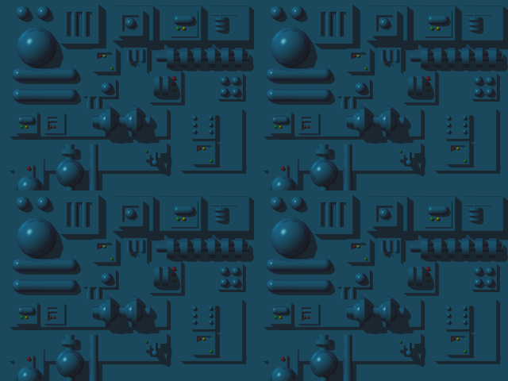
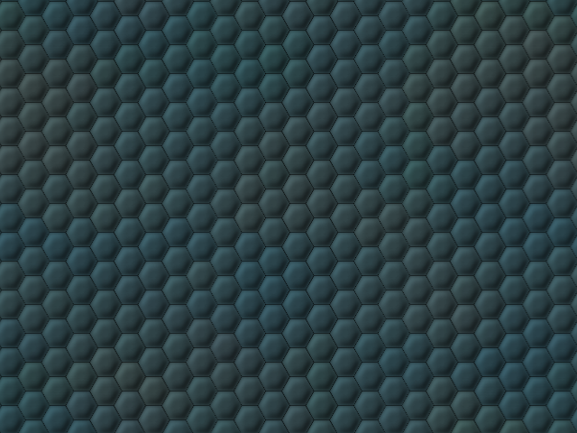

# Chapter 34: Backgrounds and Level Art

## Two rendering paths, one directory

`Content/backgrounds/` holds 38 PNG files, and this chapter's first job is separating them into the
two genuinely different rendering paths that consume them — a distinction [Chapter 28](ch28-pixmap-ipixmap.md)
and [Chapter 29](ch29-sprite-atlas-system.md) already set up but did not fully resolve against the
real file listing:

*From a directory listing of `Content/backgrounds/`:*
```
blupiyoupie.png  decor000.png  decor001.png  decor002.png  decor003.png  decor004.png
decor006.png     decor007.png  decor008.png  decor009.png  decor010.png  decor011.png
decor012.png     decor013.png  decor015.png  decor016.png  decor018.png  decor019.png
decor020.png     decor021.png  decor022.png  decor024.png  decor025.png  decor026.png
decor027.png     decor028.png  decor029.png  decor030.png  decor031.png  gear.png
init.png         lost.png      pause.png     setup.png     speedyblupi.png  trial.png
wait.png         win.png
```

28 files follow the `decorNNN.png` naming pattern (numbers 000–031, with gaps at 005, 014, 017, and
023 — levels whose region art was apparently never produced, reused from a neighboring region, or
retired). The remaining 10 are single-purpose UI/menu-screen images: `blupiyoupie.png` (the victory
"youpie" celebration art), `gear.png` (a settings/loading spinner), and seven full-screen menu
backgrounds (`init`, `lost`, `pause`, `setup`, `speedyblupi`, `trial`, `wait`, `win` — eight, not
seven, once `speedyblupi.png` is counted alongside the other seven).

## `decorNNN.png`: whole-screen images, not an icon-grid atlas

The first fact worth verifying directly, because [Chapter 29](ch29-sprite-atlas-system.md)'s atlas
table could be read as implying otherwise: `decorNNN.png` files are **not** part of the icon-grid
system `Pixmap::DrawIcon()`'s `switch (channel)` implements. Direct inspection of the shipped files
confirms this concretely — every `decorNNN.png` sampled is exactly 640×480 pixels, matching the
game's full logical canvas size, not a multi-cell grid:

```
decor000.png -> 640x480
decor001.png -> 640x480
decor010.png -> 640x480
```

`PixmapChannel::Background` (the channel these load into via `BackgroundCache()`) has **no case at
all** in `Pixmap::DrawIcon()`'s grid-parameter `switch` (`Pixmap.cpp:550-658`) — it would fall
through to `default:` (all zeros) if `DrawIcon()` were ever called with it, and nothing in the
codebase ever does. `Background` is addressed exclusively through `DrawPart()`, which takes an
explicit, hand-specified source rectangle rather than computing one from a grid cell index
([Chapter 28](ch28-pixmap-ipixmap.md)). This is a genuine correction worth stating precisely: this
book's own planning notes (`PLAN.md`) initially proposed a `640×160` grid-cell size for the
"`SpeedyBlupiBackground`" atlas table row and, before this chapter's own direct verification, that
number could plausibly have been assumed to also describe the *generic* `Background` channel used
for level art — it does not. `speedyblupi.png` genuinely is 640×160 (confirmed directly:
`Content/backgrounds/speedyblupi.png` measures exactly 640×160 pixels) and *is* addressed through
`PixmapChannel::SpeedyBlupiBackground`'s real `DrawIcon()` grid case (`Pixmap.cpp:622-630`,
[Chapter 29](ch29-sprite-atlas-system.md)) — but that is a completely separate channel, texture, and
file from the `decorNNN.png` level-background art this chapter is mainly about. The two systems
happen to share the word "background" in their channel names; they do not share a rendering path.

## `Decor::LoadImages()`: one file per region

`Decor` selects which `decorNNN.png` file to load based on `m_region`, a small integer set when a
level file loads (`Worlds::GetIntField(..., "region")`, [Chapter 44](../part08-data-persistence-content/ch44-worlds-level-file-format.md))
or defaulted to `2` by `InitDecor()` (`Decor.cpp:270`):

*From `Decor.cpp:245-252`:*
```cpp
bool Decor::LoadImages()
{
    std::ostringstream oss;
    oss << "decor" << std::setw(3) << std::setfill('0') << m_region;
    string name = oss.str();
    m_pixmap->BackgroundCache(name);
    return true;
}
```

This zero-pads `m_region` to three digits and calls `Pixmap::BackgroundCache()`
([Chapter 28](ch28-pixmap-ipixmap.md)), which loads the resulting filename into `bitmapBackground` —
the single `Texture2D` slot every `decorNNN.png` file shares, one region's worth at a time. Loading
a new region's background therefore discards the previous one from GPU memory entirely; there is no
multi-region cache, which matches the 28-file-not-38-file scope of what actually gets loaded during
ordinary gameplay (the ten menu-screen images never pass through `BackgroundCache()` at all — they
are loaded once, permanently, by `Pixmap::LoadContent()` itself, [Chapter 28](ch28-pixmap-ipixmap.md)).

## The parallax panorama: `Decor::Build()`'s own tiling, not `DrawBackground()`

The single most important fact about how `decorNNN.png` actually reaches the screen during
gameplay is that **`Decor::Build()` never calls `Pixmap::DrawBackground()`** — it calls `DrawPart()`
directly, itself, in a hand-rolled loop, to implement a scrolling parallax effect that
`DrawBackground()`'s own simple two-pass stretch-then-blit implementation
([Chapter 28](ch28-pixmap-ipixmap.md)) does not provide:

*From `Decor.cpp:649-699` (abridged):*
```cpp
void Decor::Build()
{
    TinyPoint posDecor = DecorNextAction();
    TinyPoint pos{ posDecor.X * 2 / 3, posDecor.Y * 2 / 3 };   // 2/3-scroll-speed parallax offset
    // ...
    for (int i = 0; i < 3; i++)               // up to 3 horizontal panels
    {
        // ...
        for (int j = 0; j < 2; j++)           // up to 2 vertical panels
        {
            m_pixmap->DrawPart(PixmapChannel::Background, tinyPoint, rect);
            // advance tinyPoint.Y, wrap rect back to a full 480-tall panel
        }
        // advance tinyPoint.X, wrap rect back to a full 640-wide panel
        if (tinyPoint.X > m_drawBounds.Right) { break; }
    }
    // ... a separate loop then draws m_bigDecor (Chapter 16) and m_decor tiles on top ...
}
```

The `2/3` scroll-speed factor (`posDecor.X * 2 / 3`, `posDecor.Y * 2 / 3`) is a deliberate parallax
effect: the background panorama scrolls at two-thirds the speed of the foreground tile layer, so it
visually recedes into the distance as Blupi moves — a classic parallax-scrolling trick, applied here
to a single repeating 640×480 image rather than a dedicated multi-layer parallax asset. The 3×2
panel loop (up to three horizontal repeats and two vertical repeats of the same `decorNNN.png`
image, each `DrawPart()` call sampling a different wrapped sub-rectangle) is what makes a single
640×480 image tile seamlessly across an arbitrarily large scrolled viewport without ever loading a
second copy of the texture. `Pixmap::DrawBackground()`, by contrast — the method actually named
"DrawBackground" — is reserved for the *static*, single-panel menu screens (`init.png`, `pause.png`,
`win.png`, and so on) that need no scrolling and no parallax at all; `Decor::Build()` bypasses it
entirely for gameplay because gameplay's actual requirement (scrolling, tiling, parallax) is
different from what that method implements.

## The invisible collision layer versus the visible panorama

[Chapter 16](../part04-decor-simulation/ch16-tile-map.md) established the corrected three-layer
picture of `Decor`'s rendering: the panorama background (this chapter's subject), the sparse
`m_bigDecor` overlay, and the dense `m_decor` foreground tile grid — and specifically confirmed that
the panorama takes **no `icon` parameter at all**. `IPixmap::DrawPart(PixmapChannel::Background, ...)`
slices a rectangle out of the cached whole image; there is no mechanism anywhere by which a
`m_decor[][]` or `m_bigDecor[][]` icon value selects which panorama shows. The panorama is chosen
once per level by `m_region` alone, and every tile-grid-driven sprite is layered on top of it as an
independently-positioned drawing pass. This chapter's job was to confirm what that panorama file
actually *looks like* and *how* it physically reaches the screen; the "why is it architecturally
separate from the collision grid" question belongs to Chapter 16 and is not repeated here.

## Real background art, embedded directly

`tools/extract_sprites.py`'s scope was sprite atlases and level data, not a raw copy of the
background art itself, so no `decorNNN.png` reproduction previously existed in `book/images/`. Per
this book's policy of never fabricating an image and always preferring real, unmodified game assets
where one exists, this chapter copies three real, unmodified files directly from
`Content/backgrounds/` into `book/images/` — genuine game art, not a redraw or approximation — and
records them in `book/images/MANIFEST.md`'s addendum:



*Real, unmodified copy of `Content/backgrounds/decor000.png` (640×480). Region 0's panorama —
`Decor::LoadImages()` loads this file whenever `m_region == 0`; not a screenshot, but the genuine
source PNG the game itself loads and tiles via the parallax loop described above.*



*Real, unmodified copy of `Content/backgrounds/decor010.png` (640×480). Region 10's panorama, shown
for visual contrast with region 0 — every `decorNNN.png` file is an independent, hand-painted region
backdrop, not a procedurally-varied palette swap of a shared base image.*


*Real, unmodified copy of `Content/backgrounds/blupiyoupie.png` (410×380). This is the one
background asset genuinely part of the icon-grid atlas system ([Chapter 29](ch29-sprite-atlas-system.md)),
addressed via `PixmapChannel::BlupiYoupieBackground`; `Game1.cpp` draws it repeatedly during the
victory-screen sequence with an animated destination rectangle (`Game1.cpp:711-717`, scaling and
fading it in and out) rather than a static blit — the "youpie" celebration graphic shown when a
world is completed.*

## The menu/title screens, briefly

The remaining seven images (`init.png`, `lost.png`, `pause.png`, `setup.png`, `trial.png`,
`wait.png`, `win.png`), plus `speedyblupi.png` and `gear.png`, belong to `Game1`'s title/menu state
machine rather than to `Decor`'s gameplay rendering — outside this chapter's core scope, and
genuinely outside Part V's own scope, which is the sprite/animation *system*, not the menu-flow
logic that consumes it (see [Chapter 12](../part03-architecture/ch12-game1-state-machine.md) for the
phase state machine that selects among them). It is worth noting precisely how they reach the
screen, though, since it is a third distinct usage of the same `DrawIcon()` machinery this chapter
otherwise contrasts with `DrawPart()`: `Game1.cpp` draws `SpeedyBlupiBackground`,
`BlupiYoupieBackground`, and `GearBackground` exclusively via `DrawIcon(channel, 0, rect, ...)` —
always icon `0`, since each backing file is exactly one grid cell — with an *animated destination
rectangle* computed per-frame from the current menu-transition phase and time
(`Game1.cpp:680-846`), producing the zoom/fade/rotate transitions visible when the title screen
appears, the settings gear spins, or the victory graphic scales in. This is the one place in the
codebase where the icon-grid `DrawIcon()` path (Chapter 29) and elaborate per-frame animation
(rotation, scaling, fading) combine outside of ordinary sprite-frame cycling — `Game1` is animating
the *destination rectangle* itself over time, not cycling through `icon` values the way every other
chapter in Part V has described.

## A two-gear illustration from one texture

One small detail inside `Game1.cpp`'s menu-transition code is worth calling out precisely, because
it is a genuinely clever single-texture reuse trick rather than a second image asset: the
"gear"/settings-loading animation visible during transitions is not one spinning gear graphic but
**two**, both drawn from the same single `gear.png` file, rotating in opposite directions at
different relative speeds:

*From `Game1.cpp:815-816`:*
```cpp
pixmap->DrawIcon(PixmapChannel::GearBackground, 0, rect2, opacity, rotation, false);
pixmap->DrawIcon(PixmapChannel::GearBackground, 0, rect3, opacity, (0.0 - rotation) * 0.5, false);
```

Both calls draw icon `0` (the whole 226×226 image — [Chapter 29](ch29-sprite-atlas-system.md)) at
two different destination rectangles (`rect2`/`rect3`, presumably offset so the two gears appear
interlocked or side by side), but the second call negates the rotation angle and halves its
magnitude (`(0.0 - rotation) * 0.5`) relative to the first. The visual result is two gears that
appear to mesh together — one spinning clockwise, the other spinning counter-clockwise at half
speed, exactly as two interlocking gears of different sizes would in reality — produced entirely
from rotation-angle arithmetic on a single shared texture rather than from two distinct gear-sized
image assets.

## A performance note: one texture slot, reloaded on every region change

`bitmapBackground` ([Chapter 28](ch28-pixmap-ipixmap.md)) is a single `Texture2D` member, and
`BackgroundCache()` always overwrites it in place rather than maintaining any kind of cache despite
the method's own name — every region transition therefore means the previous region's full 640×480
texture is released and a brand-new one loaded from disk (or from whatever asset-caching layer CNA's
content pipeline provides beneath this call, out of this book's scope per
[Chapter 14](../part03-architecture/ch14-xna-api-via-cna.md)) synchronously, on `Decor::LoadImages()`'s
call. For a game whose levels are typically small, self-contained rooms rather than a single
continuously-scrolling world, this is a reasonable trade-off — a full 28-image cache of every
possible region's background would cost roughly 28× a single 640×480 RGBA texture's memory footprint
permanently, for art that is only ever visible one region at a time — but it does mean a region
transition is one of the few moments in ordinary gameplay where a texture load genuinely happens
mid-session rather than entirely during a level's initial load. [Chapter 54](../part10-platform-deep-dives/ch54-ram-memory-analysis.md)
covers this game's overall memory footprint in more general terms; this chapter's contribution is
simply confirming precisely which texture slot is involved and exactly when it gets swapped.

## Why some region numbers have no file

Four `decorNNN.png` numbers are missing from the sequence (`005`, `014`, `017`, `023`) — a real,
observable gap in `Content/backgrounds/`'s file listing, not a scanning artifact of this chapter's
own directory listing above. This book has not located a definitive in-source explanation for the
gap (there is no comment in `Decor.cpp` or `Worlds.cpp` enumerating which region numbers are
"reserved" versus genuinely assigned to a level), so the honest statement is simply that these four
specific region numbers are never loaded by any of the level files this book has inspected, and the
corresponding art was apparently never produced, was retired, or is reserved for unreleased content
— any of which is plausible and none of which is confirmed. A reader building a custom level file
with `_region_` set to one of these four gap values would trigger a failed or missing texture load
in `Pixmap::BackgroundCache()` ([Chapter 28](ch28-pixmap-ipixmap.md)) — worth knowing for anyone
experimenting with the level format directly ([Chapter 44](../part08-data-persistence-content/ch44-worlds-level-file-format.md)).

## See also

- [Chapter 12 — Game1: the State Machine](../part03-architecture/ch12-game1-state-machine.md)
- [Chapter 15 — Decor: Overview](../part04-decor-simulation/ch15-decor-overview.md)
- [Chapter 16 — The Tile Map](../part04-decor-simulation/ch16-tile-map.md)
- [Chapter 28 — Pixmap/IPixmap](ch28-pixmap-ipixmap.md)
- [Chapter 29 — The Sprite Atlas System](ch29-sprite-atlas-system.md)
- [Chapter 44 — Worlds: Level File Format](../part08-data-persistence-content/ch44-worlds-level-file-format.md)
- [Chapter 45 — Content Pipeline](../part08-data-persistence-content/ch45-content-pipeline.md)
- [Chapter 54 — RAM: Memory Analysis](../part10-platform-deep-dives/ch54-ram-memory-analysis.md)
- [Appendix G — Screenshot and Visual Gallery](../appendices/appendix-g-screenshot-gallery.md)
