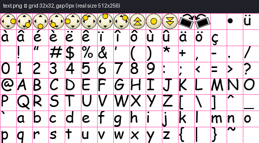

# Chapter 35: Text Rendering

## No system fonts, ever

Every piece of text this game ever draws — menu labels, HUD numbers, cheat-button glyphs, training
hints — passes through exactly one static utility class, `Text`, and is rendered entirely from a
single embedded bitmap font atlas. There is no fallback to a platform font renderer anywhere in this
codebase:

*From `Text.hpp:32-43`:*
```cpp
/**
 * @class Text
 * @brief Static utility class for drawing bitmap text using the game's font sprite sheet.
 *
 * @details All in-game text rendering passes through this class.  Characters are
 *          resolved to glyph indices via table_char and drawn by calling
 *          IPixmap::DrawChar() on the Text sprite channel.  No system fonts are
 *          used; only the embedded bitmap font is supported.
 */
```

`Text` is non-instantiable — deleted constructor and destructor, exactly like `Tables`
([Chapter 30](ch30-tables-animation-and-movement-data.md)) — and every method is `static`. It holds
no state of its own; every call takes the `IPixmap` to draw into as an explicit parameter.

## The font atlas: `text.png`



*Real atlas, 512×256 pixels, 32×32 grid cells with 0px gap — see `book/images/MANIFEST.md`. This is
`PixmapChannel::Text`'s backing texture ([Chapter 29](ch29-sprite-atlas-system.md)), one glyph per
cell, arranged as 16 columns × 8 rows = 128 addressable slots.*

Every glyph cell is a fixed 32×32 square, sliced by the same `Pixmap::GetSrcRectangle()` algorithm
[Chapter 29](ch29-sprite-atlas-system.md) documents in full — `Text` never touches pixel coordinates
itself; it only ever resolves a character to an integer glyph index and hands that index to
`IPixmap::DrawChar()`, which does the actual `DrawIcon(PixmapChannel::Text, rank, ...)` call
([Chapter 28](ch28-pixmap-ipixmap.md)).

## Three tables, one character

Resolving a single `char` to pixels on screen involves three small lookup tables, each serving a
distinct purpose:

*From `Text.hpp:52-88`:*
```cpp
static const SharpRuntime::shortcs table_char[1536];    // 256 records x 6 values
static const SharpRuntime::ubytecs table_accents[15];   // 15 accented-character codes
static const SharpRuntime::ubytecs table_width[128];    // per-glyph advance width
```

`table_char` is the largest and most structurally interesting: 256 six-element records (1,536
`shortcs` total), one record per possible character code, each describing up to *two* glyph draws:

*From `Text.cpp:8-18`:*
```
[0] Primary glyph index in the font sprite sheet.
[1] X pixel offset of the primary glyph relative to the pen position.
[2] Y pixel offset of the primary glyph relative to the pen position.
[3] Secondary glyph index, or -1 if this character needs only one draw.
[4] X pixel offset of the secondary glyph.
[5] Y pixel offset of the secondary glyph.
```

The two-draw slot exists specifically for **precomposed accented characters**: rather than storing
a separate pre-rendered glyph image for every accented letter the game supports, most accented
characters are built at draw time by overlaying a diacritic mark glyph on top of a base letter
glyph, at a small offset. Reading a real record confirms this concretely — the record for `â`
(character code 226, French circumflex-a) is:

*From `Text.cpp:172-174` (the relevant six values, located via `GetOffset()`'s accent-table search):*
```cpp
97, 0, 0, 2, 2, 0,
```
Primary glyph `97` (the base letter `a`) drawn at no offset, then secondary glyph `2` (a circumflex
mark) drawn 2 pixels to the right and at the same vertical position — composing `â` from two
existing glyphs rather than requiring a third, dedicated "â" sprite in the atlas. Most ordinary ASCII
characters use only the primary slot, with `[3]` set to `-1`:

*From `Text.cpp:38-56` (representative rows, the repeating pattern for plain ASCII):*
```cpp
0, 0, 0, -1, 0, 0,   1, 0, 0, -1, 0, 0,   2, 0, 0, -1, 0, 0, ...
```

`table_accents` is a flat list of 15 byte values — the actual character codes of the accented
letters this font supports (`ü=252, à=224, é=233, è=232, ë=235, ê=234, ï=239, î=238, ô=244, ù=249,
û=251, ä=228, ö=246, ç=231`, plus the `â` example above, `Text.cpp:194-198`) — searched linearly by
`GetOffset()` to map an incoming character code to `table_char`'s row index `15 + i`:

*From `Text.cpp:278-294`:*
```cpp
intcs Text::GetOffset(SharpRuntime::charcs c)
{
    for (int i = 0; i < 15; i++)
    {
        if (static_cast<SharpRuntime::shortcs>(c) == table_accents[i])
        {
            return 15 + i;
        }
    }
    if (c > u'\u0080')
    {
        return 1;
    }
    return static_cast<intcs>(c);
}
```

Plain ASCII (codes 0–127, excluding the 15 special accented codes above `U+0080`) resolves directly
to its own numeric value as the row index — a character code doubles as its own `table_char` row
number for the unaccented case, which is why `table_char` is exactly 256 rows long: 128 rows for
the direct ASCII range plus headroom for extended byte values, with row `1` reserved as a fallback
glyph for anything outside both the ASCII range and the 15 known accented codes.

`table_width[128]` supplies the proportional advance width for each of the font's first 128 glyph
slots at scale `1.0` — not indexed by character code, but by the *primary glyph index* resolved from
`table_char`:

*From `Text.cpp:200-215` (excerpt) and `Text.cpp:20-26`:*
```
Entries with value 32 are fixed-pitch placeholders for control-code slots (0-13)
that are not used as visible glyphs. Entries with value 0 (indices 30-31 and 127)
are non-printing. All other entries carry the measured advance width of the
corresponding glyph from the original font artwork.
```

This is a genuinely proportional bitmap font — a narrow glyph like `i` advances the pen a small
number of pixels, a wide glyph like `M` advances it much further — rather than a fixed-pitch grid
where every character consumes the same on-screen width regardless of its actual visual width.

## Drawing a character: `DrawChar()`

*From `Text.cpp:296-316`:*
```cpp
void Text::DrawChar(IPixmap& pixmap, TinyPoint& pos, const SharpRuntime::charcs car, const double size)
{
    TinyPoint pos2{};
    const intcs offset = GetOffset(car);
    const intcs num = offset * 6;

    intcs rank = table_char[num];
    pos2.X = pos.X + table_char[num + 1];
    pos2.Y = pos.Y + table_char[num + 2];
    DrawCharSingle(pixmap, pos2, rank, size);

    rank = table_char[num + 3];
    if (rank != -1)
    {
        pos2.X = pos.X + table_char[num + 4];
        pos2.Y = pos.Y + table_char[num + 5];
        DrawCharSingle(pixmap, pos2, rank, size);
    }

    pos.X += GetCharWidth(car, size);
}
```

This reads exactly as the table-format documentation above describes: always draw the primary
glyph; conditionally draw the secondary glyph only if its index isn't `-1`; then advance the pen by
the character's proportional width. `DrawCharSingle()` is a one-line forwarding wrapper to
`IPixmap::DrawChar()` (`Text.cpp:324-327`) — the thinnest possible seam between this class's
glyph-resolution logic and `Pixmap`'s actual atlas-slicing draw call
([Chapter 28](ch28-pixmap-ipixmap.md)).

## Three drawing modes: left, centered, and slanted

`Text` exposes three public drawing entry points, all built on top of `DrawChar()`:

- **`DrawTextLeft()`/`DrawText()`** — the base case: iterate every character in the string, calling
  `DrawChar()` for each, letting the pen position accumulate naturally left-to-right
  (`Text.cpp:217-234`).
- **`DrawTextCenter()`** — measures the string's total width via `GetTextWidth()`, shifts the start
  position left by half that width, then delegates to `DrawText()` (`Text.cpp:252-261`). This is
  the method `Pixmap::DrawInputButton()` uses to center a cheat digit's label inside its button icon
  ([Chapter 28](ch28-pixmap-ipixmap.md)).
- **`DrawTextPente()`** — a slanted/italic-like rendering mode, unique among the three for tracking
  an *accumulated* width rather than a per-character offset:

*From `Text.cpp:236-250`:*
```cpp
void Text::DrawTextPente(IPixmap& pixmap, TinyPoint pos, const string& text, intcs pente, double size)
{
    if (!String::IsNullOrEmpty(text))
    {
        int y = pos.Y;
        int accumulatedWidth = 0;
        for (char c : text)
        {
            int charWidth = GetCharWidth(c, size);
            DrawChar(pixmap, pos, c, size);
            accumulatedWidth += charWidth;
            pos.Y = y + accumulatedWidth / pente;
        }
    }
}
```

Each successive character's vertical position is `y + accumulatedWidth / pente` — the *total*
horizontal distance travelled so far, divided by a slant divisor `pente`, not a per-character
increment. This produces a straight diagonal line of text (each glyph sitting slightly lower — or
higher, for a negative `pente` — than the one before it, proportional to how far along the string it
is) rather than a curved or randomly-jittered baseline. `Text.hpp`'s own doc comment states the
divisor relationship plainly: "Larger `pente` values give a shallower slant" (`Text.hpp:21`) — a
larger divisor means more horizontal travel is needed to produce the same vertical displacement.
The method carries an explicit, undefended hazard in its own doc comment: `pente = 0` causes an
integer division by zero (`Text.hpp:133`) — there is no guard against it in the implementation
above, so callers are entirely responsible for never passing zero.

## Measuring text: `GetTextWidth()` and `GetCharWidth()`

*From `Text.cpp:263-275, 318-322`:*
```cpp
int Text::GetTextWidth(const string& text, double size)
{
    if (String::IsNullOrEmpty(text)) { return 0; }
    int result = 0;
    for (char c : text) { result += GetCharWidth(c, size); }
    return result;
}

intcs Text::GetCharWidth(const SharpRuntime::charcs c, const double size)
{
    const intcs offset = GetOffset(c);
    return static_cast<intcs>((static_cast<double>(table_width[table_char[offset * 6]] + 1)) * size);
}
```

`GetCharWidth()` chains both lookup tables in sequence: resolve the character to its `table_char`
row via `GetOffset()`, read that row's primary glyph index (`table_char[offset*6]`), then use *that*
index — not the original character code — to look up the advance width in `table_width`. The `+ 1`
added before scaling by `size` is a small, deliberate inter-character gap baked into every glyph's
measured width, ensuring adjacent characters are never drawn flush against one another even at the
narrowest glyphs. `GetTextWidth()` is a thin summation over every character in a string, and is the
only reason `DrawTextCenter()` can know how far to shift its starting position before drawing.

## A verified dead code path: `DrawTextPente()` is never called

One more fact is worth stating plainly because it is easy to overlook and directly relevant to how
much weight a reader should put on the slant-text feature described above: grepping every `.cpp`
file in `src/WindowsPhoneSpeedyBlupi/` for `DrawTextPente` turns up exactly one match — the method's
own definition in `Text.cpp:236`. `Decor.cpp`, `Game1.cpp`, `InputPad.cpp`, and `Pixmap.cpp` all call
`Text::DrawTextCenter()` and `Text::DrawTextLeft()` at various real sites (cheat-button labels,
debug overlays, the cheat-name list, speed indicators, key-binding labels, and general menu text —
`Decor.cpp:1248,1306`, `InputPad.cpp:1284,1312,1374,1380,1403,1455,1465`, `Game1.cpp:1030`,
`Pixmap.cpp:238`), but not one real call site anywhere in the shipped game passes through
`DrawTextPente()`. The slanted-text rendering mode is fully implemented, fully documented, and
completely unreachable from any current gameplay or UI code path — a genuine, verified example of
dead code preserved in the port rather than removed, consistent with this codebase's general
practice (seen elsewhere in this book, e.g. `table_blupi`'s padding stretch,
[Chapter 30](ch30-tables-animation-and-movement-data.md)) of carrying inherited structure forward
even where it currently serves no active purpose.

## Rendering-only, by design

`Text.hpp`'s own closing note is worth repeating precisely because it matches this book's own
part-boundary discipline: "This class is rendering-only and does not mutate any gameplay state"
(`Text.hpp:42`). Nothing in `Text` ever reads or writes `Decor`'s simulation state, `GameData`'s
save format, or any other subsystem's data — it is purely a character-code-to-pixels pipeline,
called by whichever gameplay or UI code (`Decor::CheatAction()`'s HUD labels, `Game1`'s menu text,
training-level hints from `Tables::table_training1`–`4`, [Chapter 30](ch30-tables-animation-and-movement-data.md))
happens to need a string drawn.

## See also

- [Chapter 28 — Pixmap/IPixmap](ch28-pixmap-ipixmap.md)
- [Chapter 29 — The Sprite Atlas System](ch29-sprite-atlas-system.md)
- [Chapter 30 — Tables: Animation and Movement Data](ch30-tables-animation-and-movement-data.md)
- [Chapter 36 — Jauge: HUD Gauges](ch36-jauge-hud-gauges.md)
- [Chapter 37 — Slider: UI Control](ch37-slider-ui-control.md)
- [Chapter 46 — MyResource: Resource Management](../part08-data-persistence-content/ch46-myresource-resource-management.md)
