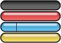

# Chapter 36: Jauge — HUD Gauges

## A widget, not an atlas cell

Every earlier chapter in this part has been about the icon-grid atlas system —
`Pixmap::GetSrcRectangle()` slicing a texture into uniform cells, addressed by a flat integer
index. `Jauge` is this book's first look at a rendering path that deliberately does **not** use
that system at all. `PixmapChannel::Jauge` has no case in `Pixmap::DrawIcon()`'s grid-parameter
`switch` ([Chapter 29](ch29-sprite-atlas-system.md)) — the entire gauge widget is drawn through
`IPixmap::DrawPart()` instead, with hand-picked source rectangles computed directly from the
gauge's current fill level.

*From `Jauge.hpp:51-72`:*
```cpp
/**
 * @class Jauge
 * @brief HUD gauge widget that renders a 124 x 22-pixel progress bar.
 *
 * @details Jauge draws a two-layer sprite: first the empty gauge background
 *          (full 124 x 22 region from PixmapChannel::Jauge), then, if the
 *          current level is greater than zero, a filled sub-region whose width
 *          is proportional to the level (0-100 mapped to 0-114 pixels).  The
 *          filled region starts after a fixed 6-pixel left border.
 *
 *          A redraw-dirty flag (m_bRedraw) avoids redundant GPU work ...
 */
```

## `jauge.png`: one image, four stacked rows



*Real, unmodified copy of `Content/icons/jauge.png` (124×88 pixels). Not gridded by
`tools/extract_sprites.py` because it is a single whole image consumed by hand-picked rectangles,
not the uniform icon-grid system [Chapter 29](ch29-sprite-atlas-system.md) documents — see the
addendum in `book/images/MANIFEST.md`.*

The file is exactly 124 pixels wide by 88 pixels tall — four stacked 124×22 rows. `JaugeMode`
names which row is the filled color:

*From `Jauge.hpp:22-28`:*
```cpp
enum class JaugeMode : intcs
{
    Empty  = 0, ///< No fill drawn (gauge is empty).
    Red    = 1, ///< Red fill -- used for danger / energy indicators.
    Blue   = 2, ///< Blue fill -- used for water level indicators.
    Yellow = 3  ///< Yellow fill -- used for charge / key indicators.
};
```

Row 0 (`Empty`) is never actually sampled as a fill color — `Draw()` only ever indexes rows 1–3 for
the filled portion (below); `Empty` exists purely as the "no fill" logical state. The top of the
whole 88-pixel image (rows 0–21, if row 0 were drawn) would show whatever the artwork happens to
contain there, but the *background* layer that always gets drawn — the empty gauge outline — is a
completely separate row-0-independent rectangle taken from the *first* 22 pixels of the image
regardless of `m_mode`, as the draw code below shows precisely.

## `Draw()`: two `DrawPart()` calls, no grid math

*From `Jauge.cpp:53-94`:*
```cpp
void Jauge::Draw()
{
    if (m_pixmap == nullptr) { return; }
    TinyRect rect{};
    if (m_bMinimizeRedraw && !m_bRedraw) { return; }
    m_bRedraw = false;
    if (!m_bHide)
    {
        int filledWidth = m_level * 114 / 100;
        rect.Left = 0;
        rect.Right = 124;
        rect.Top = 0;
        rect.Bottom = 22;
        m_pixmap->DrawPart(PixmapChannel::Jauge, m_pos, rect, m_zoom);
        if (filledWidth > 0)
        {
            rect.Left = 0;
            rect.Right = 6 + filledWidth;
            rect.Top = 22 * ToRaw(m_mode);
            rect.Bottom = 22 * (ToRaw(m_mode) + 1);
            m_pixmap->DrawPart(PixmapChannel::Jauge, m_pos, rect, m_zoom);
        }
    }
}
```

Two draws, always at the same destination position `m_pos`, with two different hand-computed source
rectangles:

1. **The background pass** always samples rows `[0, 22)` — the top strip of the image, regardless
   of `m_mode` — the full 124×22 empty-gauge outline artwork.
2. **The fill pass**, only when `filledWidth > 0`, samples `[0, 6 + filledWidth) × [22*mode, 22*(mode+1))`
   — a rectangle starting at the *same* left edge as the background (`Left = 0`) but only as wide as
   `6 + filledWidth` pixels, from whichever 22-pixel-tall row `m_mode` selects.

Because both draws share the same destination rectangle and the same `Left = 0` starting point, the
fill visually overlays the left portion of the background artwork — the fixed `6`-pixel offset in
`Right = 6 + filledWidth` accounts for the background artwork's own left border/bezel graphic, so
the colored fill begins exactly where the background's border ends rather than starting flush at
pixel 0. `filledWidth = m_level * 114 / 100` linearly maps the logical `[0, 100]` level range to a
`[0, 114]` pixel range — `114`, not `124`, again leaving room for the border on the *right* side of
the gauge too, so a full (`level = 100`) gauge's fill never overdraws past the right edge of the
124-pixel-wide background artwork.

Both `DrawPart()` calls pass `m_zoom` as the scale factor — a per-`Jauge`-instance value, not the
global viewport zoom ([Chapter 28](ch28-pixmap-ipixmap.md) noted this precisely: `DrawPart()`'s
`zoom` parameter is always an independent, caller-supplied factor, never the same `zoom` member used
by `GetDstRectangle()`). This is also the one channel `Pixmap::DrawPart()` singles out for a special
case, translating the destination by `(originX, originY)` before drawing
(`Pixmap.cpp:465-477`, [Chapter 28](ch28-pixmap-ipixmap.md)) — every other `DrawPart()` caller is
expected to have already computed screen-space coordinates itself.

## The redraw-dirty optimization

`Jauge` is the first widget in this book with an explicit, self-contained GPU-cost optimization: a
two-flag dirty-tracking scheme that skips `Draw()`'s body entirely on frames where nothing changed.

*From `Jauge.cpp:6-16` (file header):*
```
### Redraw-dirty optimisation
Jauge avoids unnecessary GPU draw calls through a two-flag scheme:
- m_bMinimizeRedraw (set once in Create()) -- enables the optimisation.
- m_bRedraw (dirty flag) -- set by any method that changes visible state
  (SetLevel(), SetMode(), SetHide(), Redraw(), SetRedraw()); cleared at the
  start of each Draw() call.

When m_bMinimizeRedraw is true and m_bRedraw is false, Draw() returns
immediately without touching the pixmap, saving fill-rate on frames where
the gauge state has not changed.
```

Every state-changing setter follows the identical pattern — compare the incoming value against the
current one, and only raise `m_bRedraw` if it actually differs:

*From `Jauge.cpp:106-121`:*
```cpp
void Jauge::SetLevel(int level)
{
    if (level < 0) { level = 0; }
    if (level > 100) { level = 100; }
    if (m_level != level)
    {
        m_bRedraw = true;
    }
    m_level = level;
}
```

`SetMode()` and `SetHide()` follow the exact same shape (`Jauge.cpp:128-149`). This means calling
`SetLevel()` every frame with an unchanged value costs nothing beyond two integer comparisons and a
clamp — the expensive `DrawPart()` calls only actually happen on frames where the gauge's visible
state genuinely changed, when `bMinimizeRedraw` was enabled at `Create()` time. Whether a given HUD
gauge instance opts into this optimization at all is a per-instance choice made by whoever calls
`Create()` (`Jauge.cpp:38-51`) — the class supports both the always-redraw and the
redraw-only-when-dirty modes side by side.

## Construction and the API surface

`Jauge`'s public surface is a straightforward getter/setter set around five pieces of state:
position (`m_pos`), fixed dimensions (`m_dim`, always `{124, 22}`), color mode (`m_mode`), fill
level (`m_level`, clamped `[0, 100]`), and visibility (`m_bHide`). The `ISound* m_sound` member is
carried purely for API-compatibility with the original C# code and is explicitly documented as
unused by any current implementation (`Jauge.hpp:67-68`) — a small, honestly-labeled piece of
inherited-but-inert API surface, the same pattern of over-precise honesty this book has favored
throughout: rather than silently dropping the parameter or pretending it does something, the header
comment states plainly that it does not.

`Create()` is the one-time setup call every `Jauge` instance requires before `Draw()` will do
anything: it stores the `IPixmap`/`ISound` pointers, records the position and mode, hard-codes the
dimensions to `124×22`, starts hidden with level `0`, and sets the dirty flag so the very first
`Draw()` call always renders regardless of the `bMinimizeRedraw` setting (`Jauge.cpp:38-51`) —
ensuring a freshly-created gauge is never accidentally skipped by the dirty-flag optimization before
it has drawn even once.

## Where `Jauge` actually appears in gameplay: `Decor::m_jauges[2]`

`Jauge` itself has no notion of what a given instance's fill level *means* — that meaning lives
entirely in `Decor`, which owns exactly two `Jauge` instances:

*From `Decor.hpp:471`:*
```cpp
Jauge m_jauges[2];
```

Both are created once, early in `Decor`'s setup, with fixed, distinct color modes:

*From `Decor.cpp:235-242`:*
```cpp
m_jauges[0] = Jauge();
m_jauges[0].Create(m_pixmap, m_sound, pos, JaugeMode::Red, false);
m_jauges[0].SetHide(true);
// ...
m_jauges[1] = Jauge();
m_jauges[1].Create(m_pixmap, m_sound, pos, JaugeMode::Yellow, false);
m_jauges[1].SetHide(true);
```

`m_jauges[0]` is Blupi's underwater breath meter. While swimming, `m_blupiLevel` counts down once
every `Config::ScaleTime(5)` ticks, and the gauge tracks it directly:

*From `Decor.cpp:4615-4629` (abridged):*
```cpp
if (m_time % Config::ScaleTime(5) == 0)
{
    if (!m_blupiShield && !m_blupiHide && !m_bSuperBlupi)
    {
        m_blupiLevel--;
    }
    if (m_blupiLevel == 25)
    {
        m_jauges[0].SetMode(JaugeMode::Red);
    }
    m_jauges[0].SetLevel(m_blupiLevel);
    if (m_blupiLevel == 0)
    {
        m_blupiAction = BlupiAction::Drown;
        // ...
    }
}
```

`m_jauges[0]` is created with `JaugeMode::Red` from the start (matching the constructor call above),
so the explicit `SetMode(JaugeMode::Red)` at `m_blupiLevel == 25` is redundant in the specific case
shown here — but it is not dead code in general: nothing shown in this excerpt prevents some other
code path from having switched the gauge to a different mode earlier, so the reassignment guarantees
the gauge is unambiguously red once Blupi's breath drops into the danger zone, regardless of
whatever mode it may have been left in previously. Reaching `m_blupiLevel == 0` triggers
`BlupiAction::Drown` directly — the 90-frame drowning animation cataloged in
[Chapter 31](ch31-blupi-animation-catalog.md) is the direct visual consequence of this gauge
reaching empty.

`m_jauges[1]` (`JaugeMode::Yellow`) is reused across a much wider variety of *temporary power/shield*
states rather than being dedicated to one specific mechanic — every one of the timed buffs and
hazards covered across [Chapter 23](../part04-decor-simulation/ch23-secret-powers-and-cheat-system.md)
and [Chapter 33](ch33-explosions-and-effects.md) (the round shield, the balloon vehicle, the crush
shield/"ecrase" state, and others) shares this single gauge instance and its single underlying
`m_blupiTimeShield` countdown, toggling its visibility and level on and off as whichever specific
timed state happens to be currently active starts and ends — never more than one of those mutually
exclusive states is active at once, so one shared gauge slot is sufficient. Both gauges are drawn
together, once per frame, by a small loop that skips any hidden instance:

*From `Decor.cpp:1250-1255` (abridged):*
```cpp
for (int i = 0; i < 2; i++)
{
    if (!m_jauges[i].GetHide())
    {
        m_jauges[i].Draw();
    }
}
```

## See also

- [Chapter 28 — Pixmap/IPixmap](ch28-pixmap-ipixmap.md)
- [Chapter 29 — The Sprite Atlas System](ch29-sprite-atlas-system.md)
- [Chapter 35 — Text Rendering](ch35-text-rendering.md)
- [Chapter 37 — Slider: UI Control](ch37-slider-ui-control.md)
- [Chapter 17 — Blupi: the State Machine](../part04-decor-simulation/ch17-blupi-state-machine.md)
- [Chapter 23 — Secret Powers and the Cheat System](../part04-decor-simulation/ch23-secret-powers-and-cheat-system.md)
